# 第 1 章：快速理解神经网络

来源：`1. 快速理解神经网络 2026秋.pptx`，65 页。页码按文件中的实际幻灯片顺序计数，忽略课件里未更新的 `/80` 页脚。重复的逐步演示合并为完整推导。

## 目录

- [深度学习与大模型的发展](#history)
- [神经元与深度网络](#neuron)
- [前向传播与完整例题](#forward)
- [目标函数、梯度下降与反向传播](#training)
- [CNN 与卷积完整例题](#cnn)
- [填充、步幅、通道和池化](#conv-options)
- [RNN 与长期依赖](#rnn)
- [LSTM 的状态与门控公式](#lstm)

## 1. 深度学习与大模型的发展

**对应课件第 4–9 页。** 深度学习通过多层可训练的非线性变换学习数据表示。课件用以下代表性工作说明应用范围：

| 工作 | 课件标注年份 | 任务与意义 |
|---|---:|---|
| AlexNet，Krizhevsky 等 | 2012 | 图像分类；卷积网络学习视觉特征 |
| AlphaGo，Silver 等 | 2016 | 围棋决策；深度学习与搜索、强化学习结合 |
| StyleGAN，Karras 等 | 2018 | 高质量人脸等图像生成；这里沿用预印本年份 |
| AlphaFold 2，Jumper 等 | 2021 | 蛋白质结构预测 |
| Stable Diffusion / 潜空间扩散工作，Rombach 等 | 2022 | 文本条件图像生成 |
| ChatGPT | 2022 | 对话式语言生成 |

课件展示的 AlphaFold 2 图例包括 CASP14 相比早期系统的精度提升，以及预测结构与实验结构的重叠：T1037/6vr4（RNA polymerase domain）为 90.7 GDT，T1049/6y4f（adhesin tip）为 93.3 GDT。GDT 是结构预测评估指标，这些数字是原图中的历史结果。

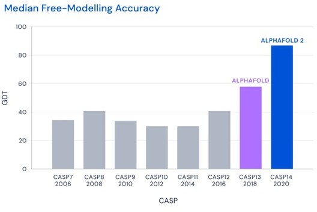

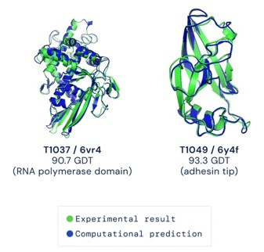

课件主线为 Transformer（2017）→ GPT-1（2018）→ GPT-3（2020）→ 2022 年以后大语言模型快速发展。模型时间线包含不同规模、开放程度、语言及多模态方向；以下保留技术谱系原图中的模型名称、时间与分支关系，图片反映课件选用资料的时间范围。

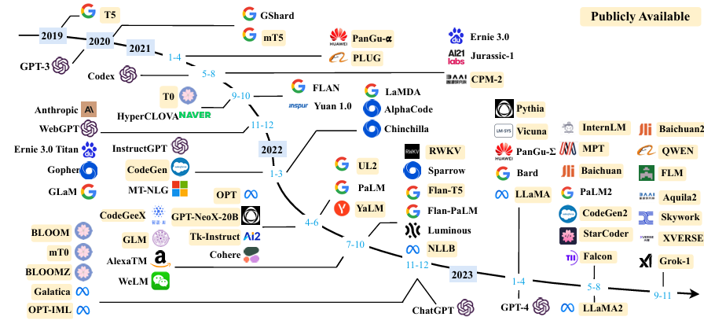

基础模型可作为多个下游系统的共同起点。LLaMA 衍生图展示继续预训练、指令微调、聊天数据、人类反馈、合成数据、代码及多模态扩展等路线；多条路径可以组合，并非只存在一种“基础模型→聊天模型”的过程。

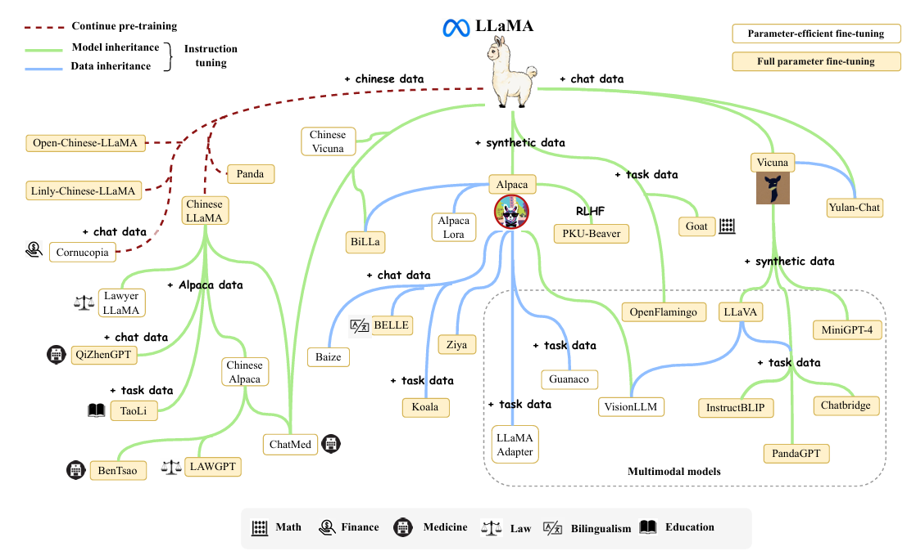

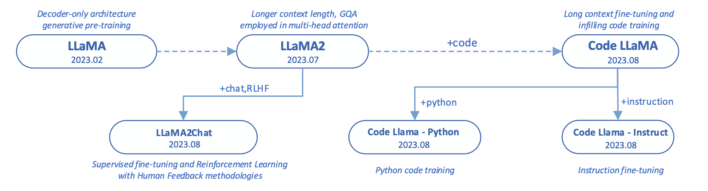

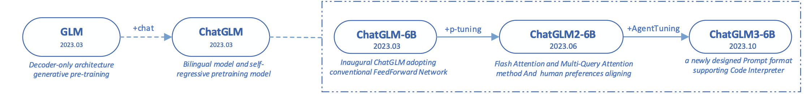

LLaMA 为 decoder-only 自回归预训练模型；课件第 9 页图中，LLaMA2（2023.07）强调更长上下文、GQA 和更多预训练数据，LLaMA2Chat 使用监督微调与人类反馈，Code Llama（2023.08）使用代码继续预训练，进一步分出 Python 与 Instruct 分支。具体模型特性应以所指版本为准。

原图来源：课件引用的 [A Survey of Large Language Models](https://arxiv.org/abs/2303.18223)；第 9 页备注另列 [A Survey on Recent Advances in LLM-Based Multi-turn Dialogue Systems](https://arxiv.org/abs/2402.18013)。这里保留课件给出的来源关系，不宣称每张图都出自该论文的当前版本。品牌标识、新闻截图、装饰性生成图片不再收录。

## 2. 神经元与深度网络

**对应课件第 11–15 页。** 生物神经元通过树突接收信号、轴突传递信号，树突和突触具有复杂的非线性行为。课件用“约 1000 亿个神经元”作为人脑规模的粗略量级说明，人工神经元只抽象其中的加权整合与非线性响应，不等同于完整的生物机制。

人工神经元先计算加权和，再经过激活函数：

$$
z=b+\sum_{j=1}^{d}w_jx_j,\qquad a=\sigma(z).
$$

$x_j$ 是输入，$w_j$ 是权重，$b$ 是偏置，$\sigma$ 是非线性激活函数，$a$ 是输出。课件也用 $\theta_0$ 表示偏置；将输入扩充为 $\tilde x=(1,x_1,\ldots,x_d)^\top$ 后可统一写为 $a=\sigma(\theta^\top\tilde x)$。

多个神经元组成层，多个层组成网络。输入层提供数据，隐藏层学习中间表示，输出层产生预测。课件中的“2-layer neural net”和“1-hidden-layer neural net”指同一个结构：**计算层数通常不把输入层算作参数层**。

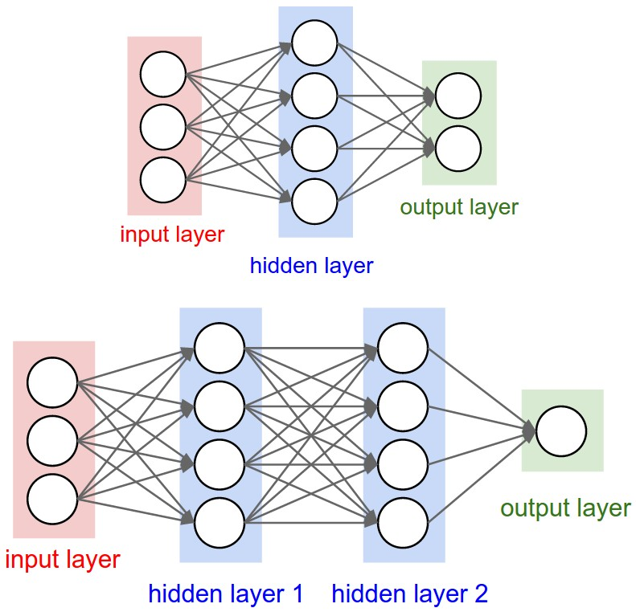

训练数据与模型的符号：

$$
\mathcal D=\{(x_1,y_1),\ldots,(x_n,y_n)\},\qquad \hat y_i=f(x_i;\Theta).
$$

$x_i$ 是第 $i$ 个输入，$y_i$ 是目标值或分类标签，$\Theta$ 是全部可学习参数。课件示例取标量输出 $f(x;\Theta)\in\mathbb R$；多分类或多输出任务可改为向量输出。

## 3. 前向传播与完整例题

**对应课件第 16–20 页。** 前向传播由输入逐层计算预测。沿用课件权重转置的约定：

$$
h^{(0)}=x,\qquad h^{(\ell)}=\sigma_\ell\bigl(\Theta_\ell^\top h^{(\ell-1)}+b_\ell\bigr),\qquad \hat y=h^{(k)}.
$$

课件省略偏置、各层使用同一激活时，写为：

$$
\hat y=\sigma\left(\Theta_k^\top\sigma\left(\Theta_{k-1}^\top\cdots\sigma(\Theta_1^\top x)\cdots\right)\right).
$$

常见激活包括 sigmoid、tanh、ReLU 与 softplus：

$$
\sigma(x)=\frac1{1+e^{-x}},\qquad \tanh(x)=\frac{e^x-e^{-x}}{e^x+e^{-x}},
$$

$$
\operatorname{ReLU}(x)=\max(0,x),\qquad \operatorname{softplus}(x)=\log(1+e^x).
$$

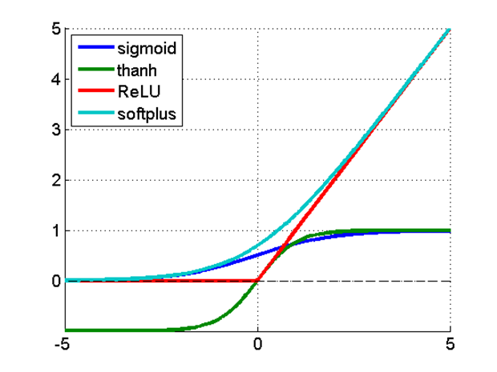

### 3.1 课件两层网络的计算

输入及输出层权重为：

$$
x_i=\begin{bmatrix}1.0\\-0.5\end{bmatrix},\qquad
\Theta_2=\begin{bmatrix}-0.2\\0.5\\1.3\end{bmatrix}.
$$

**原题符号不一致。** 第 17–20 页反复显示的初始权重图写的是

$$
\Theta_1^{\text{初始图}}=
\begin{bmatrix}1.2&2.1&1.5\\-0.3&-0.7&0.3\end{bmatrix},
$$

但第 19 页矩阵乘法将第三个权重写成 $-1.5$，后续隐藏值 $0.16$ 和预测 $0.62$ 都沿用这个负号。下面完整保留**后续演示实际使用的版本**：

$$
\Theta_1=
\begin{bmatrix}1.2&2.1&-1.5\\-0.3&-0.7&0.3\end{bmatrix}.
$$

第一步，计算隐藏层的线性输入：

$$
\Theta_1^\top x_i=
\begin{bmatrix}1.2&-0.3\\2.1&-0.7\\-1.5&0.3\end{bmatrix}
\begin{bmatrix}1.0\\-0.5\end{bmatrix}
=\begin{bmatrix}1.35\\2.45\\-1.65\end{bmatrix}.
$$

第二步，逐元素使用 sigmoid：

$$
h_1=\begin{bmatrix}\sigma(1.35)\\\sigma(2.45)\\\sigma(-1.65)\end{bmatrix}
\approx\begin{bmatrix}0.79413\\0.92056\\0.16111\end{bmatrix}.
$$

课件将隐藏值截写为 $[0.79,0.92,0.16]^\top$。第三步，计算输出层：

$$
z_2=\Theta_2^\top h_1\approx0.510896,\qquad \hat y_i=\sigma(z_2)\approx0.625017.
$$

按课件显示的两位隐藏值计算，则 $z_2=-0.2(0.79)+0.5(0.92)+1.3(0.16)=0.51$，$\sigma(0.51)\approx0.62481$，课件显示 $0.62$。中间值是否先舍入会影响最后的两位结果。

如果坚持使用初始图的 $+1.5$，则第三个隐藏值改为 $\sigma(1.35)\approx0.79413$，最后预测约为 **0.79147**；它不能同时得到原演示的 $0.16$ 和 $0.62$。以上两套数据明确区分，避免把笔误当成正确推导。

## 4. 目标函数、梯度下降与反向传播

**对应课件第 21–22 页。** 训练是在数据集上寻找使平均损失最小的参数：

$$
\min_\Theta L(\Theta),\qquad
L(\Theta)=\frac1n\sum_{i=1}^{n}\ell\bigl(f(x_i;\Theta),y_i\bigr).
$$

课件列举均方误差（MSE）与交叉熵。用于解释的常见具体形式为：

$$
L_{\text{MSE}}=\frac1n\sum_i(\hat y_i-y_i)^2,
$$

$$
L_{\text{分类}}=-\frac1n\sum_i\sum_c y_{i,c}\log p_{i,c}.
$$

梯度下降沿**负梯度**方向更新：

$$
\Theta^{(t+1)}=\Theta^{(t)}-\gamma\nabla_\Theta L(\Theta^{(t)}),\qquad
\nabla_\Theta L=\frac1n\sum_i\nabla_\Theta\ell_i.
$$

$\gamma$ 是学习率。课件的“向梯度方向更新”应结合公式中的减号理解为沿负梯度下降；学习率过大可能越过低损失区域、震荡甚至发散，过小则进展缓慢。

反向传播用链式法则从输出层向前计算各层梯度。补充写出与前向式相容的形式：

$$
\delta^{(k)}=\frac{\partial\ell}{\partial h^{(k)}}\odot\sigma_k'(z^{(k)}),\qquad
\delta^{(\ell)}=(\Theta_{\ell+1}\delta^{(\ell+1)})\odot\sigma_\ell'(z^{(\ell)}),
$$

$$
\frac{\partial\ell}{\partial\Theta_\ell}=h^{(\ell-1)}(\delta^{(\ell)})^\top,\qquad
\frac{\partial\ell}{\partial b_\ell}=\delta^{(\ell)}.
$$

这里 $\odot$ 为逐元素乘法。课件按“最后一层→前面的层”解释误差传递；标准实现先基于一次前向传播使用的参数算齐梯度，再由优化器统一更新参数。

## 5. CNN 与卷积完整例题

**对应课件第 24–47 页。** 卷积神经网络的基本流程是卷积、非线性激活、降采样或池化，再由全连接层完成分类或回归。卷积层扫描局部区域，学习边缘、纹理等局部特征；不同卷积核生成不同特征图。较高层结合这些特征形成更抽象的表示，全连接层将展平后的特征映射到输出空间。

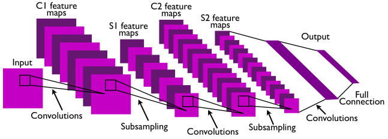

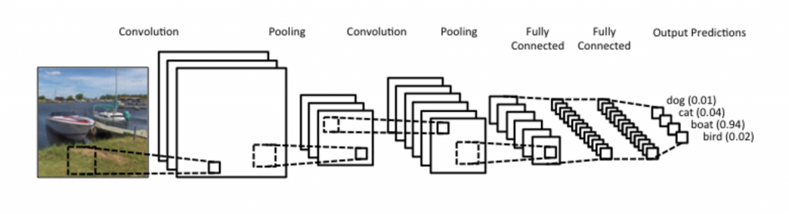

### 5.1 卷积操作

卷积核与当前输入窗口做 Hadamard product（对应元素相乘），然后求和得到一个输出值；核移动后重复。深度学习框架通常把不翻转核的**互相关**操作也称为卷积，课件例题就是这种操作。

**以下按图形坐标恢复矩阵，并合并第 26–47 页的所有滑动步骤。** 原始输入为：

$$
X=\begin{bmatrix}
1&1&1&0&0\\
0&1&1&1&0\\
0&0&1&1&1\\
0&0&1&1&0\\
0&1&1&0&1
\end{bmatrix},\quad
K_1=\begin{bmatrix}1&0&1\\0&1&0\\1&0&1\end{bmatrix},\quad
K_2=\begin{bmatrix}0&1&0\\1&0&1\\0&1&0\end{bmatrix}.
$$

步幅 $S=1$，不填充，输出为 $3\times3$：

$$
Y^{(r)}_{i,j}=\sum_{u=0}^{2}\sum_{v=0}^{2}X_{i+u,j+v}K^{(r)}_{u,v}.
$$

左上角计算：

$$
\begin{bmatrix}1&1&1\\0&1&1\\0&0&1\end{bmatrix}\odot K_1
=\begin{bmatrix}1&0&1\\0&1&0\\0&0&1\end{bmatrix},\quad \sum=4.
$$

同一窗口与 $K_2$ 相乘后求和为 $1+0+1+0=2$。所有窗口结果如下，完整保留课件逐个演示的 18 个输出：

| 窗口左上角（行，列，从1开始） | $K_1$ 输出 | $K_2$ 输出 |
|---|---:|---:|
| (1,1) | 4 | 2 |
| (1,2) | 3 | 4 |
| (1,3) | 4 | 2 |
| (2,1) | 2 | 2 |
| (2,2) | 4 | 3 |
| (2,3) | 3 | 4 |
| (3,1) | 2 | 2 |
| (3,2) | 3 | 3 |
| (3,3) | 5 | 2 |

$$
Y_1=\begin{bmatrix}4&3&4\\2&4&3\\2&3&5\end{bmatrix},\qquad
Y_2=\begin{bmatrix}2&4&2\\2&3&4\\2&3&2\end{bmatrix}.
$$

参考：课件原链指向 Stanford 的 Feature extraction using convolution；完整数值已重算校验，不依赖该旧网页仍可访问。

## 6. 填充、步幅、通道和池化

**对应课件第 48–56 页及讲者备注。**

| 概念 | 含义 | 本例 |
|---|---|---|
| Kernel | 卷积核空间尺寸与权重 | $3\times3$ |
| Zero-padding | 输入边界补零，允许核覆盖边缘 | 四周补一圈零 |
| Stride | 相邻窗口移动距离 | $S=1$ 或 $S=2$ |
| Channel | 输入或输出特征的通道 | 两个核产生两张输出特征图 |
| Pooling | 聚合邻域并降采样 | 最大值或平均值 |

补充一般输出尺寸公式（无 dilation）：

$$
H_{\text{out}}=\left\lfloor\frac{H+2P-K_h}{S_h}\right\rfloor+1,\qquad
W_{\text{out}}=\left\lfloor\frac{W+2P-K_w}{S_w}\right\rfloor+1.
$$

### 6.1 Zero-padding

本例 $5\times5$ 输入配 $3\times3$ 核，$P=0,S=1$ 得 $3\times3$。四周各补一圈零后输入成为 $7\times7$，$P=1,S=1$ 得 $5\times5$，输出空间尺寸与原输入一致。课件第 49 页强调边界填充可使图像边缘参与卷积。

### 6.2 Stride

不填充、$S=2$ 时，核从输入位置 $(1,1),(1,3),(3,1),(3,3)$ 开始，输出为：

$$
Y_{1,S=2}=\begin{bmatrix}4&4\\2&5\end{bmatrix}.
$$

它与第 50–54 页的四个逐步结果一致；步幅增大使输出更小。

### 6.3 多通道

对于 RGB 图像，输入具有三个通道。一个普通卷积核会覆盖全部输入通道；输出值先在空间与输入通道维度求和，再加偏置。多个核对应多个输出通道。补充公式：

$$
Y_{i,j,o}=b_o+\sum_{c=1}^{C_{\text{in}}}\sum_u\sum_v
K_{u,v,c,o}X_{iS_h+u-P,jS_w+v-P,c}.
$$

若不分组，参数量为 $C_{\text{out}}(K_hK_wC_{\text{in}}+1)$。课件备注提到 GoogLeNet / Inception 的卷积层配置；第 48 页实际内嵌图片是问号装饰，没有可读的配置表，因此不虚构该表。

### 6.4 Pooling

池化减少特征图尺寸、计算量与内存需求，同时保留某些重要特征。课件以缩小后仍能辨认的鸟作直觉说明。最大池化取窗口最大值；平均池化取窗口均值，通常对各通道分别执行。

对本例整张 $3\times3$ 特征图做一次池化：

$$
\operatorname{MaxPool}(Y_1)=5,\qquad\operatorname{MaxPool}(Y_2)=4,
$$

$$
\operatorname{AvgPool}(Y_1)=\frac{30}{9}=\frac{10}{3}\approx3.3333,\qquad
\operatorname{AvgPool}(Y_2)=\frac{24}{9}=\frac83\approx2.6667.
$$

**第 56 页平均池化有笔误：** 原式把 $Y_2$ 九项之和除以 6，得到 4。九个元素的平均必须除以 9；4 是这张图的最大值，也是错误除以 6 的结果，不能当作平均池化值。

## 7. RNN 与长期依赖

**对应课件第 58–60 页。** 循环神经网络在序列各步共享参数，用隐藏状态传递历史信息。补充标准形式：

$$
h_t=\phi(W_xx_t+W_hh_{t-1}+b_h),\qquad y_t=g(W_yh_t+b_y).
$$

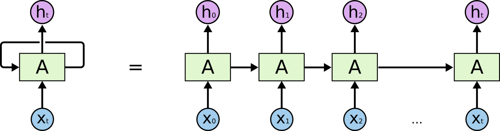

输入 $x_t$ 与上一步状态 $h_{t-1}$ 决定当前状态；常规递推必须按时间顺序计算。课件例句 “The clouds are in the sky” 用前面的语境预测后面的词，说明序列任务需要保留相关上下文。

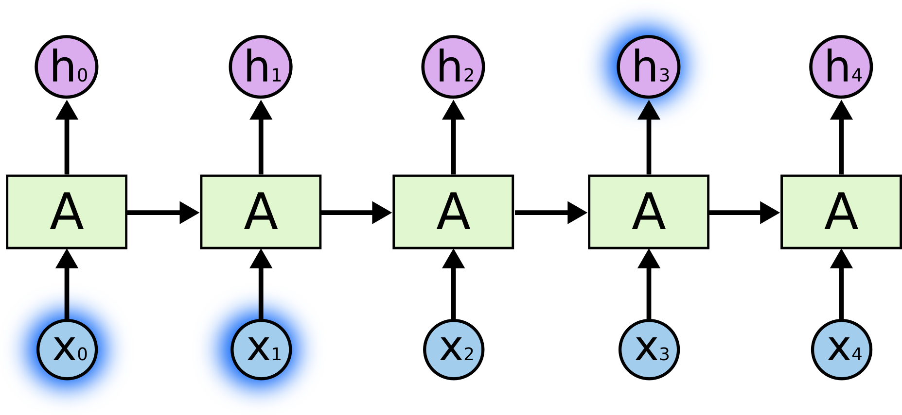

当依赖距离很长，普通 RNN 难以保留所需信息，反向传播中的连续 Jacobian 乘积可能使梯度衰减或放大。LSTM 通过单独的细胞状态与门控机制改善长期信息传递，但不能保证任意长度依赖都能无损记住。

## 8. LSTM 的状态与门控公式

**对应课件第 61–65 页。** LSTM（Long Short-Term Memory，长短期记忆网络）是 RNN 的一种门控变体。普通 RNN 的循环单元主要是简单的非线性变换；LSTM 引入细胞状态和遗忘门、输入门、输出门。

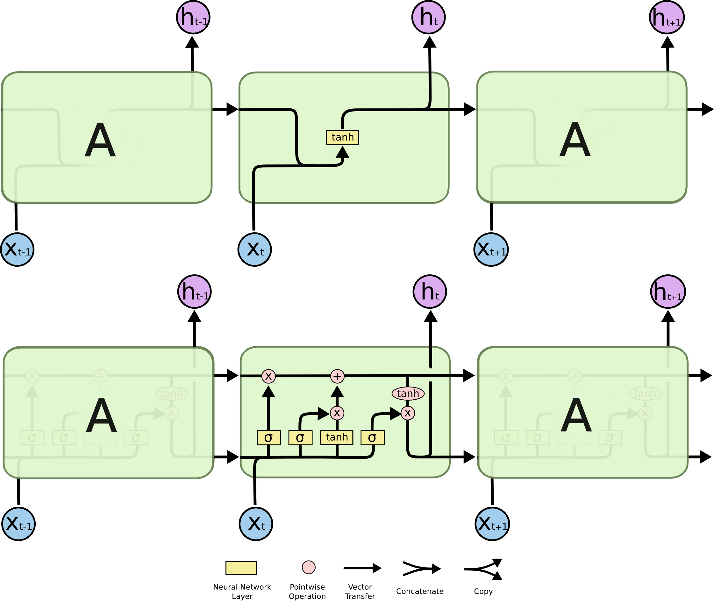

图中黄色方块表示神经网络层，圆圈表示逐元素操作，箭头表示向量传递，汇合表示拼接，分叉表示复制。记 $C_t$ 为细胞状态，$h_t$ 为隐藏状态。在课件图示中，单元输出就是 $h_t$；任务的最终预测还可以经过额外输出层。

### 8.1 核心思想

细胞状态沿单元上方贯穿整个时间链，类似传送带。它主要经过逐元素乘法和加法，因而比反复经过普通 RNN 的非线性变换更容易维持信息。门由 sigmoid 层与逐元素乘法组成，在 0 到 1 之间选择信息通过的程度。

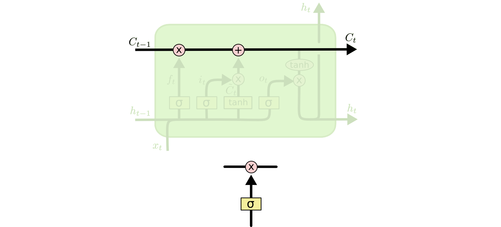

### 8.2 完整计算顺序

先将 $h_{t-1}$ 与 $x_t$ 拼接，记为 $[h_{t-1},x_t]$。遗忘门决定旧状态保留多少：

$$
f_t=\sigma(W_f[h_{t-1},x_t]+b_f).
$$

输入门决定写入多少新信息，候选状态提出可写入的内容：

$$
i_t=\sigma(W_i[h_{t-1},x_t]+b_i),\qquad
\tilde C_t=\tanh(W_C[h_{t-1},x_t]+b_C).
$$

旧状态与新信息结合，形成更新后的细胞状态：

$$
C_t=f_t\odot C_{t-1}+i_t\odot\tilde C_t.
$$

输出门决定暴露多少状态信息；隐藏状态由经过 tanh 的细胞状态产生：

$$
o_t=\sigma(W_o[h_{t-1},x_t]+b_o),\qquad h_t=o_t\odot\tanh(C_t).
$$

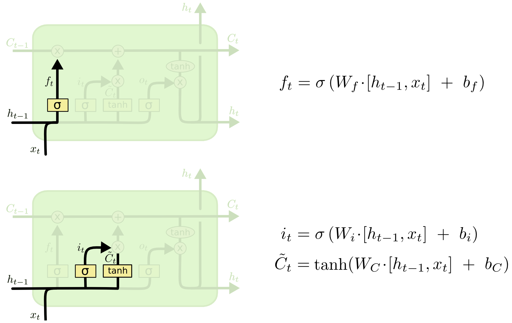

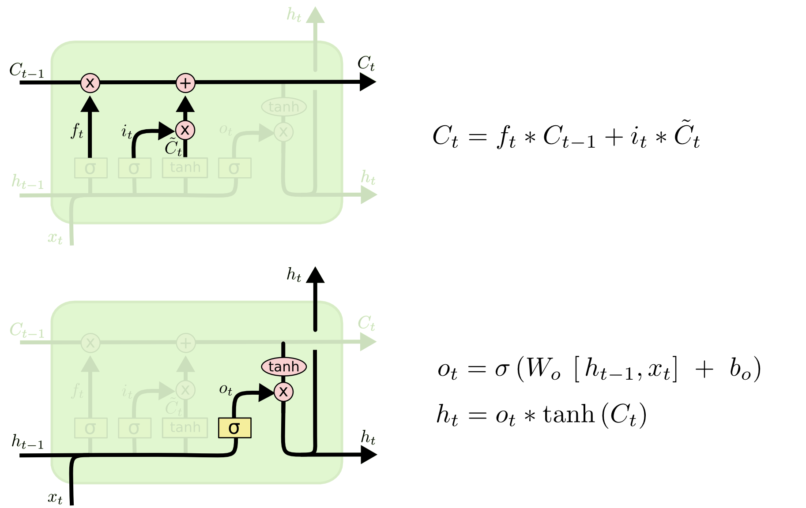

第 65 页文字简写 `output_gate * updated_state`，原图公式包含 **tanh**；完整隐藏状态公式必须保留这个非线性变换。这里的“*”指逐元素乘法，不能替换为矩阵乘法。

## 本章与后续章节的连接

激活函数决定非线性表示及梯度性质，详见[第 2 章激活函数](02-self-attention.md#activations)；RNN、LSTM 与自注意力的上下文建模差异，详见[第 2 章结构比较](02-self-attention.md#comparison)。训练目标中的交叉熵将在[第 3 章语言模型例题](03-transformer.md#loss)中按词表索引逐步计算。
