# 第 2 章：Self Attention（自注意力）

来源：`2. Self Attention 2026秋.pptx`，64 页。知识点包含正文、公式、图形和讲者备注；重复动画页面合并，课件中有关激活函数和稳定训练的补充一并保留。

## 目录

- [注意力的直觉与发展](#origin)
- [向量序列输入与三种输出任务](#inputs)
- [从独立分类到上下文建模](#context)
- [单个位置的 QKV 计算](#qkv)
- [矩阵形式、维度与并行计算](#matrix)
- [多头自注意力](#multihead)
- [位置编码](#position)
- [与 CNN、RNN、LSTM 的比较](#comparison)
- [ResNet、残差与扩展深度](#residual)
- [全部激活函数与梯度性质](#activations)
- [归一化及稳定训练](#stability)

<a id="origin"></a>
## 1. 注意力的直觉与发展

**对应课件第 2–4 页。** 心理学意义的注意力是选择性处理信息、分配有限认知资源的过程。课件引用威廉·詹姆斯的观点作引入：面对同时出现的对象或思维，集中处理其中相关的一部分。神经网络中的注意力把这种“选择相关信息”转化为可学习的权重计算。

课件用故事接龙说明 QKV：捡到黑色笔记本→寻找主人→封皮变白→偏振实验→梦境、当兵、奥德赛、醒来与电影院等线索。当前要续写的问题是 Query，前文线索的可检索特征是 Key，线索对应的信息是 Value；颜色、光线、梦境、醒来分别对应不同检索方向。

| 元素 | 直觉 | 在计算中的作用 |
|---|---|---|
| Query（查询） | 我需要什么信息？ | 与各个 Key 计算匹配分数 |
| Key（键） | 我能够提供哪类信息？ | 表示可检索的特征 |
| Value（值） | 被检索到后提供什么内容？ | 按归一化权重汇聚的信息 |
| Attention score | 此线索与当前问题多相关？ | 原始分数；经过 softmax 后才是非负权重 |

故事本身不能按字面“加权相加”。真正参与线性加权和的是数值向量，而非几段自然语言的直接混合；这也是课件第 3 页对类比的限制说明。

### 1.1 技术时间线

课件第 4 页列举 Transformer、GPT、BERT、GPT-3、Performer、FlashAttention、LoRA、GPT-4、RoPE，及 2025 年的 DeepSeek-R1、Tiny-R1、Gemini 2.5、Gemma 3、Claude Sonnet 4。这里保留模型名称，删除品牌标识和论文封面截图；这些工作分别涉及架构、预训练、注意力效率、参数高效适配、位置编码及推理能力，不能全当成新的注意力算子。

| 时间 | 课件涉及的工作 | 要点 |
|---|---|---|
| 2017 | Transformer | 以注意力为核心的序列建模架构 |
| 2018 | GPT、BERT | 分别代表自回归预训练与双向编码预训练 |
| 2020 | GPT-3、Performer | 规模化语言模型与注意力近似路线 |
| 2021 | RoPE、LoRA | 旋转位置编码、低秩适配；原课件分别放在 2023、2022 年，按论文首发日期更正 |
| 2022 | FlashAttention | 重视存储读写的高效精确注意力实现 |
| 2023 | GPT-4 | 课件用于说明大模型能力发展 |
| 2025 | DeepSeek-R1、Tiny-R1、Gemini 2.5、Gemma 3、Claude Sonnet 4 | 课件列举的推理、蒸馏和多模态模型方向 |

日期修正依据：[RoFormer / RoPE（2021）](https://arxiv.org/abs/2104.09864)、[LoRA（2021）](https://arxiv.org/abs/2106.09685)。本章不把历史时间线改写为当前模型排名。

<a id="inputs"></a>
## 2. 向量序列输入与三种输出任务

**对应课件第 5–12 页。** 单个向量输入可以预测一个标量或类别；实际任务往往输入一组向量，序列长度可以变化。文字、语音、图结构都需要变成数值表示。

### 2.1 文本：one-hot 与 embedding

课件例句为 `this is a cat`。假设词表按 apple、bag、cat、dog、elephant 等排列，则：

```text
apple    = [1, 0, 0, 0, 0, ...]
bag      = [0, 1, 0, 0, 0, ...]
cat      = [0, 0, 1, 0, 0, ...]
dog      = [0, 0, 0, 1, 0, ...]
elephant = [0, 0, 0, 0, 1, ...]
```

One-hot 维度等于词表大小，没有直接编码词间相似性。Word embedding 使用可学习的稠密向量，课件图示以 dog、cat、rabbit，jump、run，flower、tree 等词的邻近关系说明词向量可表达语义关系。

### 2.2 语音：连续信号分帧

课件使用采样率 16 kHz、窗口长 25 ms、帧移 10 ms：

$$
16000\times0.025=400\ \text{采样点/窗口},\qquad
1\text{s}/10\text{ms}\approx100\ \text{帧}.
$$

每帧可提取 39 维 MFCC 或 80 维 filter-bank 特征，成为一个向量。100 帧是帧移频率的近似说明，实际帧数还取决于边界与填充方式，不能仅用窗口长度求帧数。

### 2.3 图：节点向量及关系

社交图可把个人资料编码成节点向量，边描述人与人的关系，可用于网络安全等节点或关系分析。分子图把原子当作节点：

```text
H = [1, 0, 0, ...]
C = [0, 1, 0, ...]
O = [0, 0, 1, ...]
x_i = [元素类型, 电荷, 杂化方式, 芳香性, 连接度, ...]
```

注意力矩阵可视为输入相关的加权连边，自注意力因而可从图消息传递角度理解。课件的“Transformer 也是一种 GNN”是这一视角；普通全连接注意力不自动保留真实图的邻接结构，若任务需要它，须通过掩码、边特征或图结构偏置引入。

### 2.4 输出任务

| 类型 | 输入与输出长度 | 课件例子 |
|---|---|---|
| 序列标注 | $N\to N$ ，每个输入向量有标签 | 词性标注、逐帧语音标签、社交节点的 buy / not 分类 |
| 整体分类或回归 | $N\to1$ | `this is good` → positive；说话人识别；分子亲水性 |
| Seq2seq | $N\to N'$ ，输出长度由模型决定 | 翻译及序列生成 |

本讲核心从序列标注出发。`I saw a saw` 的标签分别为代词、动词、限定词、名词；两个相同拼写的 saw 需要不同的上下文表示。

<a id="context"></a>
## 3. 从独立分类到上下文建模

**对应课件第 13–17 页。** 对每个词独立应用共享的全连接网络，若两个 saw 的输入向量一样，就会产生一样的输出，无法区分词性。引入局部窗口能获得附近信息，但很大的窗口会增加参数与计算负担，也不自然适应不同长度。

自注意力允许每个位置根据当前输入决定关注哪些位置，从整个序列汇聚信息。输入可来自词向量，也可来自某个隐藏层；输出与输入具有相同位置数，但具体表示已加入上下文。

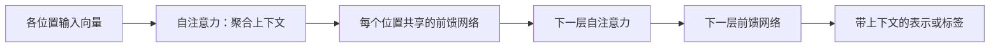

课件描述层次分工：浅层可能处理词形、位置与局部关系，中间层形成句法与语义表示，高层更贴近预测任务。这是常见的解释性观察，具体头或层的分工需要实证分析；反复堆叠并不保证任意加深都提高精度。

<a id="qkv"></a>
## 4. 单个位置的 QKV 计算

**对应课件第 18–23 页。** 为与原稿一致，先用列向量 $a^i$ 表示第 $i$ 个位置，**上标 $i$ 是位置索引，不是幂**。可学习参数对所有位置共享：

$$
q^i=W^qa^i,\qquad k^i=W^ka^i,\qquad v^i=W^va^i.
$$

$W^q,W^k$ 将输入映射到相同的匹配维度 $d_k$ ， $W^v$ 映射到值维度 $d_v$ 。Query 与 Key 用不同矩阵，使“我在寻找什么”与“我提供什么”能够分别学习，匹配一般也无需对称；同一种投影在不同位置共享，使模型适应可变长度。

### 4.1 四个输入的逐步例子

输入为 $a^1,a^2,a^3,a^4$ 。计算位置 1 的输出时，查询来自 $a^1$ ，键和值来自四个位置，**也包括自己**：

$$
\alpha_{1,1}=(q^1)^\top k^1,\quad
\alpha_{1,2}=(q^1)^\top k^2,\quad
\alpha_{1,3}=(q^1)^\top k^3,\quad
\alpha_{1,4}=(q^1)^\top k^4.
$$

课件为便于演示先省略缩放。标准 scaled dot-product attention 则使用

$$
s_{i,j}=\frac{(q^i)^\top k^j}{\sqrt{d_k}}.
$$

当各分量近似独立、方差为 1 时，未缩放点积的方差约为 $d_k$ ，维度增大会使 softmax 易趋于尖锐，缩放有助于控制分数尺度。[原始 Transformer 论文](https://arxiv.org/abs/1706.03762)给出这一动机。

对固定 Query，在 Key 位置维度上做 softmax，课件记为 $\alpha'_{1,j}$ ：

$$
\alpha'_{1,j}=\frac{\exp(\alpha_{1,j})}{\sum_{r=1}^{4}\exp(\alpha_{1,r})},\qquad
\sum_{j=1}^{4}\alpha'_{1,j}=1.
$$

使用标准缩放时，将上式的 $\alpha_{1,j}$ 换成 $s_{1,j}$ 。数值实现先减去该行最大值再求指数，以减少溢出；减去共同常数不改变 softmax。

接着加权求和：

$$
b^1=\alpha'_{1,1}v^1+\alpha'_{1,2}v^2+\alpha'_{1,3}v^3+\alpha'_{1,4}v^4.
$$

位置 2 重复同样过程，但 Query 改为 $q^2$ ：

$$
b^2=\sum_{j=1}^{4}\alpha'_{2,j}v^j.
$$

位置 3、4 同理。相同 Key 与 Value 可被多个 Query 使用；每个 Query 有自己的一组归一化权重。四个位置的输出计算可以同时进行，单个输出无需等前一个输出完成。

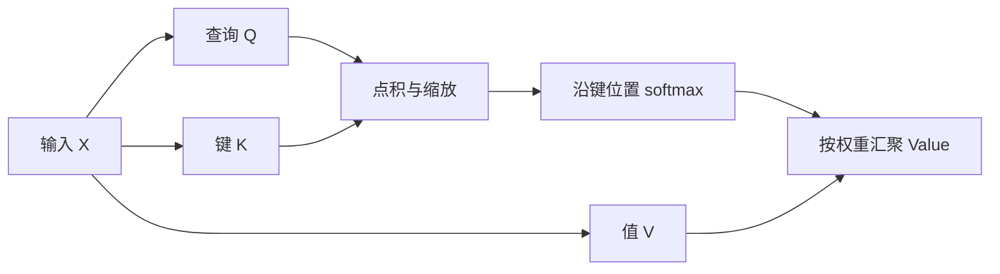

<a id="matrix"></a>
## 5. 矩阵形式、维度与并行计算

**对应课件第 24–28 页。** 为与常见实现一致，以下改用**每行一个位置**的约定：

$$
X\in\mathbb R^{N\times d},\quad
Q=XW_Q,\quad K=XW_K,\quad V=XW_V.
$$

| 张量 | 形状 | 含义 |
|---|---|---|
| $X$ | $N\times d$ | $N$ 个输入位置 |
| $W_Q,W_K$ | $d\times d_k$ | 查询与键投影 |
| $W_V$ | $d\times d_v$ | 值投影 |
| $Q,K$ | $N\times d_k$ | 每个位置的查询与键 |
| $V$ | $N\times d_v$ | 每个位置的值 |
| $S=QK^\top/\sqrt{d_k}$ | $N\times N$ | 行为 Query、列为 Key 的分数 |
| $A=\operatorname{softmax}_{\text{行}}(S)$ | $N\times N$ | 每行和为 1 的注意力权重 |
| $O=AV$ | $N\times d_v$ | 加入上下文的输出 |

$$
\operatorname{Attention}(Q,K,V)=\operatorname{softmax}\left(\frac{QK^\top}{\sqrt{d_k}}\right)V.
$$

对于课件的四位置例子，分数矩阵包含全部 16 个两两匹配项：

$$
S=\begin{bmatrix}
s_{1,1}&s_{1,2}&s_{1,3}&s_{1,4}\\
s_{2,1}&s_{2,2}&s_{2,3}&s_{2,4}\\
s_{3,1}&s_{3,2}&s_{3,3}&s_{3,4}\\
s_{4,1}&s_{4,2}&s_{4,3}&s_{4,4}
\end{bmatrix},\qquad
O=\begin{bmatrix}(b^1)^\top\\(b^2)^\top\\(b^3)^\top\\(b^4)^\top\end{bmatrix}.
$$

### 5.1 与课件列向量写法对照

若像前节一样每列一个输入，令 $I=[a^1\ a^2\ \cdots\ a^N]\in\mathbb R^{d\times N}$ ，则：

$$
Q_c=W^qI,\quad K_c=W^kI,\quad V_c=W^vI,
$$

$$
S_c=\frac{K_c^\top Q_c}{\sqrt{d_k}},\quad
A_c=\operatorname{softmax}_{\text{列}}(S_c),\quad O_c=V_cA_c.
$$

此时行是 Key、列是 Query，每列的权重和为 1。它与行向量形式互为转置；**不能把列堆叠的 QKV 与行 softmax 的公式直接拼在一起**。课件把输入记为 $I$ ，这里的 $I$ 不是单位矩阵。

学习的是投影矩阵等参数；每次输入生成的注意力矩阵是中间结果，通常不作为一张固定参数表保存。投影、两两匹配和加权聚合都能组织为矩阵乘法，适合 GPU 并行。

标准稠密注意力在匹配与聚合阶段约需 $O(N^2d_k+N^2d_v)$ 运算，显式保存权重需要 $O(N^2)$ 空间；此外还包括线性投影成本。并行计算不等于总计算量小。

<a id="multihead"></a>
## 6. 多头自注意力

**对应课件第 29–31 页。** 不同头可以学习不同类型的相关性。课件以两个头说明：

$$
q^i=W^qa^i,\qquad
q^{i,1}=W^{q,1}q^i,\qquad q^{i,2}=W^{q,2}q^i,
$$

键和值也分别生成 $k^{i,1},k^{i,2},v^{i,1},v^{i,2}$ 。每个头用自己的一套查询、键和值独立计算：

$$
s^{(h)}_{i,j}=\frac{(q^{i,h})^\top k^{j,h}}{\sqrt{d_k}},\qquad
b^{i,h}=\sum_j\operatorname{softmax}_j(s^{(h)}_{i,j})v^{j,h}.
$$

两个头的输出拼接后经过输出投影：

$$
b^i=W^O\begin{bmatrix}b^{i,1}\\b^{i,2}\end{bmatrix}.
$$

课件的“两次线性投影”可在代数上合并为有效投影 $W^{q,h}W^q$ ；标准实现通常直接从 $X$ 做每个头的投影，再 reshape / split，不要求先额外生成一份共用 Q。

统一的行向量公式为：

$$
\operatorname{head}_h=\operatorname{Attention}(XW_h^Q,XW_h^K,XW_h^V),
$$

$$
\operatorname{MultiHead}(X)=\operatorname{Concat}(\operatorname{head}_1,\ldots,\operatorname{head}_H)W^O.
$$

常见设置 $d_k=d_v=d/H$ ，因此 $d$ 必须能按所选头数切分；拼接恢复宽度 $d$ 。多头允许同时表达多种关系，并不保证每个头都有固定的人类可读语义。

<a id="position"></a>
## 7. 位置编码

**对应课件第 32–33 页。** 纯粹不带位置编码或掩码的自注意力对输入重排保持等变，内容本身不能完整决定先后顺序。课件把它简写为“因为并行所以没有位置信息”，更准确的原因是计算没有显式引入位置，而非并行本身造成丢失。

给每个位置加入位置向量：

$$
\tilde a^i=a^i+e^i.
$$

$e^i$ 可由人为设计的函数生成，也可从数据学习，维度需与 $a^i$ 匹配。为辅助理解，补充原始 Transformer 的正弦、余弦形式：

$$
PE(p,2r)=\sin\left(\frac p{10000^{2r/d}}\right),\qquad
PE(p,2r+1)=\cos\left(\frac p{10000^{2r/d}}\right).
$$

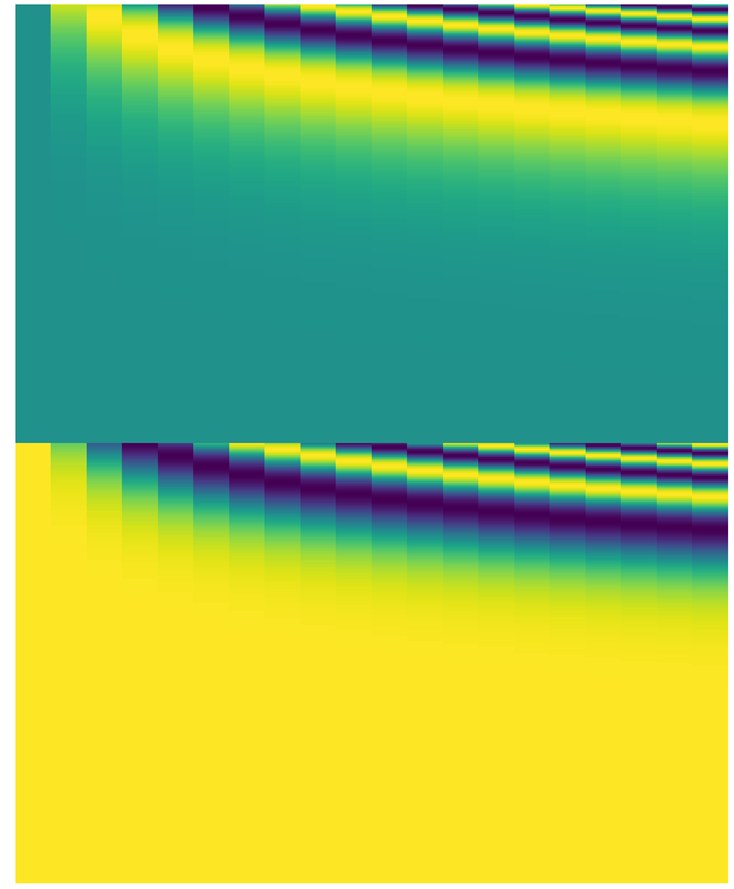

原图把一个位置向量按列展示，并将 sine / cosine 区域分成两半；备注用 20 个位置、512 维表示举例。图像转置及按半区排列是一种展示方式，不能据此把标准公式的奇偶维交错约定混淆。自注意力在 Transformer 与 BERT 等 NLP 架构中广泛使用。

<a id="comparison"></a>
## 8. 与 CNN、RNN、LSTM 的比较

**对应课件第 34–38 页及备注。**

| 结构 | 信息来源与感受野 | 并行性 | 主要特点与代价 |
|---|---|---|---|
| CNN | 固定局部核；堆叠逐步扩大感受野 | 同层各位置可并行 | 局部性与共享权重带来较强归纳偏置，常对较少训练数据更友好 |
| RNN | 历史压缩在递归状态中 | 常规时间递推串行 | 易处理顺序，长距离信息经过多次状态变换 |
| LSTM | 门控细胞状态保存历史 | 常规时间递推串行 | 改善长期依赖，但仍有压缩与递推成本 |
| 全局自注意力 | 一个位置直接聚合所有允许位置 | 同一层各位置可并行 | 易连接远距离信息；稠密版本匹配成本随长度平方增长 |

课件把 CNN 比作“只看固定感受野的注意力”，把自注意力比作“可学习感受野的 CNN”。这是直觉比较，二者不在所有设置下严格等价。研究表明，在适当的位置表示、足够头数等条件下，多头注意力可表达卷积操作。[关系研究论文](https://arxiv.org/abs/1911.03584)

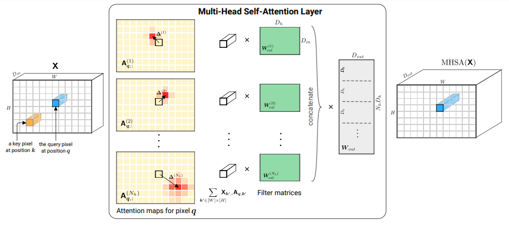

### 8.1 ViT 与数据规模

课件第 36 页选用 ViT 结果：将图像切为 patch 序列后进行 Transformer 建模。ViT-L/16 表示 Large 模型、 $16\times16$ patch。图中横轴是 JFT 预训练样本规模（10M、30M、100M、300M），纵轴是 ImageNet 的 linear 5-shot Top-1 准确率；比较 ViT-L/16、ViT-L/32、ViT-B/32、ViT-b/32、ResNet50x1（BiT）、ResNet152x2（BiT）。保留原图以完整呈现各曲线及数量关系。

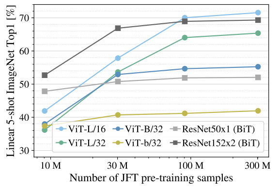

Few-shot linear evaluation 是冻结预训练特征，在少量标注样本上训练线性分类器并评估准确率。这里是 **5-shot**；课件备注中的“通常少于 6 个样本”不是 few-shot 的普遍定义。原图支持特定实验中大规模预训练对 ViT 的帮助，不能推出所有注意力模型都必然需要更多数据。[ViT 原论文](https://arxiv.org/abs/2010.11929)

### 8.2 与递归结构的联系

RNN / LSTM 通过状态保存记忆；自注意力直接访问各位置表示，容易建立远距离联系。训练时注意力位置可并行，但**自回归生成不同时间步仍顺序进行**。课件还引用 [Transformers are RNNs: Fast Autoregressive Transformers with Linear Attention](https://arxiv.org/abs/2006.16236)：特定线性注意力可改写为递归计算，它不是说所有标准 softmax Transformer 都等同于普通 RNN。备注另列 [Attention-based Memory Selection Recurrent Network for Language Modeling](https://arxiv.org/abs/1611.08656) 作为 RNN 与注意力结合的相关阅读。

<a id="residual"></a>
## 9. ResNet、残差与扩展深度

**对应课件第 39–41 页、第 57 页。** 深度网络存在退化问题：增加层数后，训练误差也可能变大；这与单纯过拟合造成测试误差增大不同。课件展示 56 层普通网络与 20 层普通网络的训练、测试误差对照。

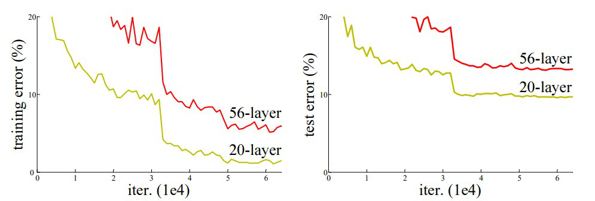

残差块将输入直接加到分支输出：

$$
y=x+F(x).
$$

当额外层不需要改变表示时，可以让 $F(x)\approx0$ ，更容易实现恒等映射。补充梯度表达式：

$$
\frac{\partial y}{\partial x}=I+\frac{\partial F}{\partial x}.
$$

这提供直接的信息与梯度路径，改善深层网络训练；仍不能保证梯度永不消失或爆炸。相加的维度必须一致，维度变化时可用投影捷径。课件 ResNet 图的残差分支为两层 weight layer，内部使用 ReLU，求和后再有 ReLU；Transformer 的子层激活布局不必完全照搬这个 CNN 残差块。

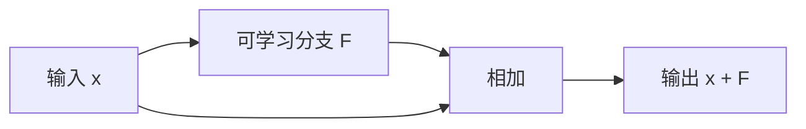

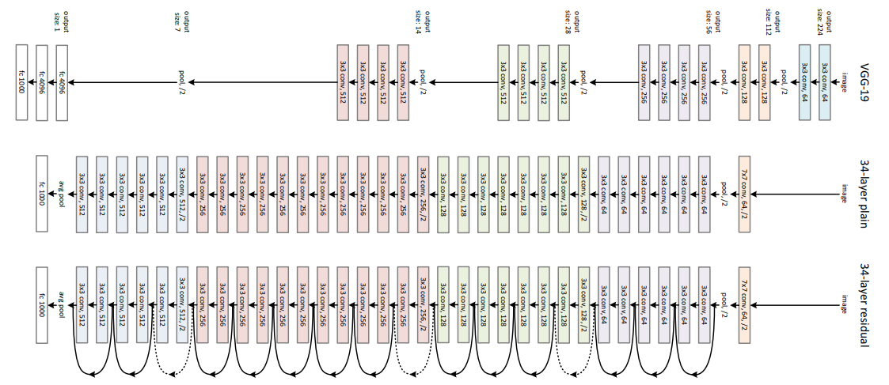

ResNet-34 原图说明捷径如何贯穿更深架构；课件据此引出具有很多 Attention block、甚至上百层的大模型可扩展性。是否能有效扩展还取决于归一化、初始化、优化和数据等条件。

<a id="activations"></a>
## 10. 全部激活函数与梯度性质

**对应课件第 42–53 页、第 61–63 页及备注；第 1 章重复介绍在此展开。** 激活函数引入非线性。导数连乘可以导致梯度问题，因此不仅要看输出曲线，也要看导数。

### 10.1 Sigmoid

$$
\sigma(x)=\frac1{1+e^{-x}},\qquad \sigma'(x)=\sigma(x)(1-\sigma(x))\in(0,1/4].
$$

输出 $(0,1)$ 适合二分类概率输出和门控；在零附近敏感，极端输入趋近 0 或 1，导数趋近 0。输出不以零为中心，在深层隐藏层中常不如其他激活好训练。最大导数为 $0.25$ ，多层连乘可能迅速缩小梯度。课件第 43 页导数式少一个闭括号，这里修正。

### 10.2 Tanh

$$
\tanh(x)=\frac{e^x-e^{-x}}{e^x+e^{-x}},\qquad \tanh'(x)=1-\tanh^2(x).
$$

输出 $(-1,1)$ ，有正负值、函数关于原点对称，减轻 sigmoid 的非零中心问题；在浅层网络、循环状态及 sigmoid 的替代场景中有用。但极端输入仍饱和，导数趋近 0；“零中心”不意味着对任意输入分布的实际输出均值都恰好为 0。

### 10.3 ReLU

$$
\operatorname{ReLU}(x)=\max(0,x),\qquad
\operatorname{ReLU}'(x)=\begin{cases}0&x<0\\1&x>0.\end{cases}
$$

计算简单、速度快，正区间导数为 1，广泛用于隐藏层。负区间导数为 0，可能出现长期不再更新的“死亡神经元”；零点不可微，实现选择约定的次梯度。正区间不饱和，也不自动防止激活过大、数值溢出或整个网络的梯度爆炸。

### 10.4 Leaky ReLU

$$
f(x)=\begin{cases}x&x>0\\\alpha x&x\le0,\end{cases}\qquad \alpha\text{ 常取 }0.01.
$$

负区间保留小斜率，减轻死亡神经元，同时保留 ReLU 的计算效率。需要选择超参数 $\alpha$ ；负区间梯度可能仍很小，且不能排除整个网络梯度爆炸。适用于希望减少 ReLU 死亡现象的模型。

### 10.5 ELU

$$
f(x)=\begin{cases}x&x>0\\\alpha(e^x-1)&x\le0.\end{cases}
$$

负输出有助于把激活均值向零移动，负区间平滑，可减少硬截断带来的死亡问题，代价是指数计算更复杂。输出不保证均值为零；当 $x\to-\infty$ ，负区间导数 $\alpha e^x\to0$ ，所以课件备注的“负区间梯度不会消失”不能按绝对保证理解。零点两侧导数相同只在 $\alpha=1$ 时成立。

### 10.6 SELU

$$
f(x)=\lambda\begin{cases}x&x>0\\\alpha(e^x-1)&x\le0,\end{cases}\qquad
\lambda\approx1.0507,\quad\alpha\approx1.67326.
$$

其目标是自归一化：在一定条件下使多层表示趋向均值 0、方差 1，改善深层信号与梯度尺度，减少对额外归一化的依赖。课件强调输入标准化、LeCun normal 初始化及架构条件；不满足条件时不能保证效果。

补充：需要 dropout 时应考虑配套的 AlphaDropout，不能直接认定普通 dropout 保留自归一化。课件把 SELU 与 BatchNorm 写成“不兼容”，更适合理解为二者的设计目标可能重复或相互改变统计条件，而不是程序上无法组合。[Self-Normalizing Neural Networks](https://arxiv.org/abs/1706.02515)

### 10.7 Hard Sigmoid

$$
f(x)=\max(0,\min(1,0.2x+0.5)).
$$

这是课件使用的分段线性近似，输出 $[0,1]$ ；在 $(-2.5,2.5)$ 导数为 $0.2$ ，两端饱和区导数为 0。实现简单、适合嵌入式与低功耗环境，但近似误差和饱和问题仍存在，不同框架的 hard sigmoid 可能采用不同系数。

### 10.8 Hard Tanh

$$
f(x)=\begin{cases}-1&x<-1\\x&-1\le x\le1\\1&x>1.\end{cases}
$$

线性区导数为 1，区间外导数为 0，计算快速，适合固定数值范围下的高效率任务。课件把折点称作“discontinuities”，实际函数连续，问题是 $\pm1$ 处不可微、区间外梯度为零；需要精细梯度变化时可能不合适。

### 10.9 ArcTan

$$
f(x)=\arctan(x),\qquad f'(x)=\frac1{1+x^2}.
$$

平滑、输出 $(-\pi/2,\pi/2)$ ，零附近敏感；大输入时导数趋近 0，仍存在梯度消失倾向。课件把它作为适合小数值、浅层场景的平滑有界激活介绍。

### 10.10 曲线对照与选型表

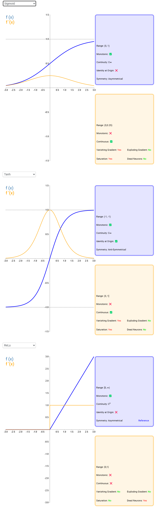

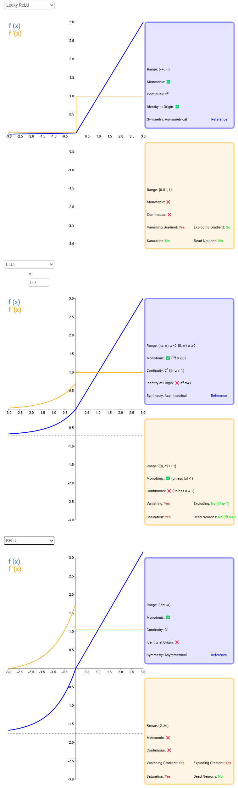

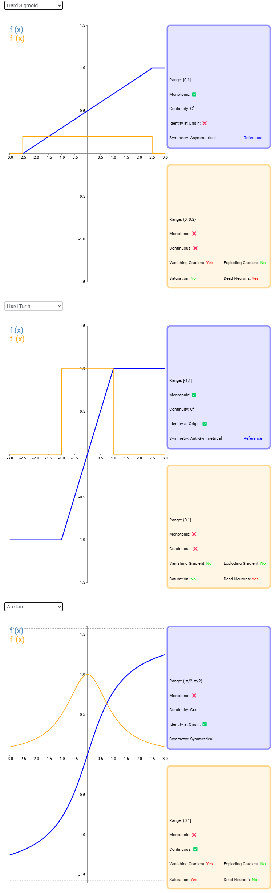

| 激活 | 输出范围 | 饱和与梯度 | 课件强调的使用情境 |
|---|---|---|---|
| Sigmoid | $(0,1)$ | 两端饱和，导数最大 $1/4$ | 概率输出、门控 |
| Tanh | $(-1,1)$ | 两端饱和；有正负输出 | 浅层网络、状态表示 |
| ReLU | $[0,\infty)$ | 负区间为零；正区间不饱和 | 常见深层隐藏层 |
| Leaky ReLU | 常用 $\alpha>0$ 时为 $\mathbb R$ | 负区间小斜率 | 减轻神经元死亡 |
| ELU | $(-\alpha,\infty)$ ， $\alpha>0$ | 负端饱和 | 希望改善负输入处理和均值偏移 |
| SELU | $(-\lambda\alpha,\infty)$ | 依赖自归一化条件 | 特定初始化与标准化输入的深层网络 |
| Hard Sigmoid | $[0,1]$ | 两端截断，折点不可微 | 低资源环境 |
| Hard Tanh | $[-1,1]$ | 区间外零梯度，折点不可微 | 快速有界近似 |
| ArcTan | $(-\pi/2,\pi/2)$ | 大输入导数接近零 | 小输入、浅层场景 |

原图中的性质标签只作为辅助，公式和上面的条件说明优先。函数的零中心、是否平滑，以及实际输出分布的均值方差，是不同性质。

<a id="stability"></a>
## 11. 归一化及稳定训练

**对应课件第 55–60 页、第 64 页；第 54 页只有预告与品牌图，已删除。** 课件提出激活均值接近 0、方差接近 1 有助于稳定训练，理由包括：

1. 控制各层信号与梯度尺度，缓解过大或过小的连乘效应。
2. 使正负响应更平衡，减少部分激活函数长期进入饱和区的风险，改善信息传递。
3. 改善数值条件和优化尺度，促进收敛，减少模型用于纠正尺度偏移的负担。
4. 在一些设置中起到间接正则化作用，提高鲁棒性与泛化。
5. 减少不同神经元、不同层更新幅度严重失衡的情况。

这些是设计动机，**不是均值和方差满足条件后就自动保证不发散、不饱和、不过拟合**。学习率、权重的谱性质、残差布局、损失和数据仍影响训练。

### 11.1 BatchNorm 与 LayerNorm

对于形状 $[B,T,D]$ 的序列表示，LayerNorm 通常对每个样本、每个 token 的 $D$ 个特征求统计量；BatchNorm 的统计轴取决于具体实现，一般包含 batch 轴，也可能包含序列轴。LayerNorm 不跨样本依赖，便于可变长度和数据并行，不需要推理时的 running mean / variance。

### 11.2 Post-LN 与 Pre-LN

$$
\text{Post-LN}:\quad y=\operatorname{LN}(x+F(x)),
$$

$$
\text{Pre-LN}:\quad y=x+F(\operatorname{LN}(x)).
$$

原始 Transformer 使用 Post-LN。Pre-LN 通常更易稳定优化，课件据此强调其可扩展性；课件的“无需 warm-up”应理解为相关论文在特定设置中可移除预热，并非所有规模和训练方案都如此。[LayerNorm 位置研究](https://arxiv.org/abs/2002.04745)

详细 LayerNorm 公式、统计轴和布局见[第 3 章归一化](03-transformer.md#normalization)，避免重复整套推导。

### 11.3 其他稳定训练措施

课件列出的其余措施为：残差连接、decoder-only 的因果历史建模、RMSprop / Adam 自适应优化，以及先预热再衰减学习率。它们分别改善信息路径、架构组织与参数更新，并不单凭 decoder-only、优化器或衰减学习率就解决梯度消失。

Decoder-only 将 masked self-attention 与前馈网络堆叠用于序列生成，详细结构见[第 3 章](03-transformer.md#decoder-only)。优化器动画、各方法作用、warm-up 曲线与学习率策略统一见[第 3 章优化与调度](03-transformer.md#optimization)。
