# 第 3 章：Transformer

来源：`3.Transformer 2026秋.pptx`，51 页。本章保留 Encoder、Decoder、训练、解码和实验提示。重复出现的残差、优化器与学习率内容在本章或第 2 章集中讲解，并给出交叉引用。

## 目录

- [Seq2seq 与整体结构](#seq2seq)
- [Encoder、前馈网络与 BERT](#encoder)
- [LayerNorm、BatchNorm 与 Pre/Post-LN](#normalization)
- [自回归 Decoder、因果掩码与停止](#autoregressive)
- [非自回归 Decoder](#nat)
- [Cross-attention 与 T5](#cross-attention)
- [Teacher forcing 与下一 token 训练](#teacher-forcing)
- [交叉熵完整数值例题](#loss)
- [优化器与学习率调度](#optimization)
- [Padding 与掩码](#padding)
- [Greedy 与 Beam Search](#beam)
- [温度采样](#temperature)
- [Decoder-only 与实验实现清单](#decoder-only)

<a id="seq2seq" name="seq2seq"></a>
## 1. Seq2seq 与整体结构

**对应课件第 2–3、15、29、50 页。** Sequence-to-sequence 输入一个序列，输出另一个序列，二者长度可不同：

$$
(x_1,\ldots,x_N)\longmapsto(y_1,\ldots,y_{N'}).
$$

课件例子包括语音识别（声学帧→“机器学习”）、机器翻译（“机器学习”→“machine learning”）、语音翻译（语音→另一语言的文字或语音），以及缺少文字表示的语言相关任务。把语音识别与翻译简单串接是一种方案，但也会传递前一系统的错误；Seq2seq 提供统一建模视角。

Encoder 将输入编码为表示序列，Decoder 结合这些表示与自己的生成历史输出目标序列。Encoder 的一般概念不限于 Transformer，也可以由 CNN 或 RNN 构成。

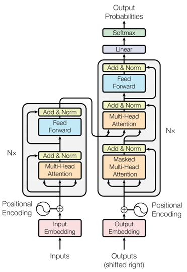

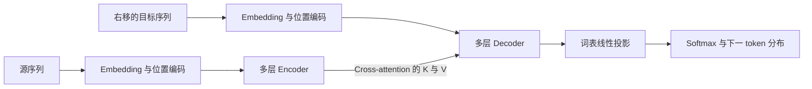

<a id="encoder" name="encoder"></a>
## 2. Encoder、前馈网络与 BERT

**对应课件第 4–7、12–13 页。** Encoder 每层通常包含多头自注意力和逐位置前馈网络，配合残差连接与归一化；叠加多个 block 后，将每个输入位置转换为加入上下文的表示。

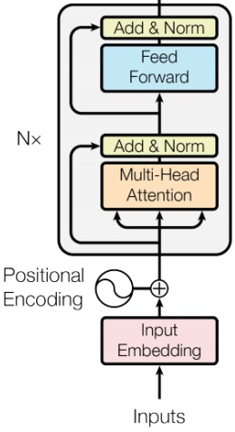

在原始 Post-LN 布局下，单层可写成：

$$
U=\mathrm{LN}\bigl(X+\mathrm{MultiHeadSelfAttention}(X)\bigr),
$$

$$
H=\mathrm{LN}\bigl(U+\mathrm{FFN}(U)\bigr).
$$

课件把前馈子层简写成 FC。补充原始 Transformer 的具体形式：

$$
\mathrm{FFN}(x)=\max(0,xW_1+b_1)W_2+b_2,
$$

其中 $W_1\in\mathbb R^{d\times d_{\text{ff}}}$ 、 $W_2\in\mathbb R^{d_{\text{ff}}\times d}$ 。同一层的 FFN 参数在各位置共享，FFN 负责逐位置的非线性变换，注意力负责跨位置的信息混合。不同 block 通常有不同参数。实际训练还可包含 dropout；上述公式突出课件讲解的主干。

残差相加要求两个分支形状匹配，它为梯度提供直接路径。课件第 12 页与第 2 章的残差内容重复，完整原理与 ResNet 对照见[第 2 章](02-self-attention.md#residual)。

BERT 使用 Transformer encoder 类型的架构；它通过双向上下文形成表示，而非把传统自回归 Decoder 直接换名。[BERT 原论文](https://arxiv.org/abs/1810.04805)

<a id="normalization" name="normalization"></a>
## 3. LayerNorm、BatchNorm 与 Pre/Post-LN

**对应课件第 6–11、14 页；合并第 2 份课件第 55–56 页。**

### 3.1 LayerNorm 的完整公式

课件对一个 $K$ 维向量写 $x_i'=(x_i-m)/\sigma$ 。这里均值与标准差来自**当前向量的特征维**：

$$
\mu=\frac1D\sum_{j=1}^D x_j,\qquad
\mathrm{var}(x)=\frac1D\sum_{j=1}^D(x_j-\mu)^2,
$$

$$
\mathrm{LN}(x)_j=\gamma_j\frac{x_j-\mu}{\sqrt{\mathrm{var}(x)+\epsilon}}+\beta_j.
$$

补充的 $\epsilon>0$ 防止除零， $\gamma,\beta$ 是可学习的缩放与平移参数。归一化后、仿射变换前的统计量被控制，但最终输出不必严格均值为 0、方差为 1。

### 3.2 为什么序列模型常用 LayerNorm

输入通常为 $X\in\mathbb R^{B\times T\times D}$ ： $B$ 是 batch， $T$ 是序列长度， $D$ 是隐藏维度。

| 对比项 | LayerNorm | BatchNorm |
|---|---|---|
| 典型统计轴 | 每个样本、每个位置自己的特征维 $D$ | 每个通道跨 batch；有些实现同时跨位置 |
| 不同样本是否相互影响统计量 | 否 | 是 |
| 可变序列长度 | 无需跨样本对齐统计量 | 序列与填充处理会影响统计量 |
| 推理是否依赖运行均值与方差 | 通常不依赖 | 常用 running statistics |
| 数据并行 | 无需同步跨样本统计量 | 若采用 SyncBatchNorm 则同步统计量 |

课件强调 LayerNorm 适合变长序列，不需额外维护全局均值方差，训练和推理使用相同的逐向量统计逻辑。它与不同设备上的数据并行相容。普通 BatchNorm 可以各设备独立计算本地统计量；“必须同步”仅适用于希望得到跨设备一致 batch 统计的设置。

### 3.3 Post-LN 与 Pre-LN

对于任一注意力或 FFN 子层 $F$ ：

$$
\text{Post-LN}: y=\mathrm{LN}(x+F(x)),\qquad
\text{Pre-LN}: y=x+F(\mathrm{LN}(x)).
$$

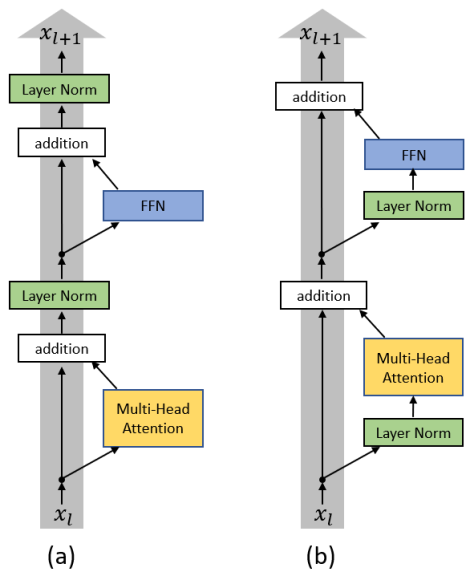

原始 Transformer 使用 Post-LN。研究指出其初始化时靠近输出层的梯度可能较大，预热学习率有助于稳定训练；Pre-LN 的初始化梯度更温和，在论文实验条件下可取消预热。[On Layer Normalization in the Transformer Architecture](https://arxiv.org/abs/2002.04745)

课件同时指出 Pre-LN 可能有最终性能下降的情形，Post-LN 更难训练但在某些设定下最终效果更好；这是一种条件性的优化与性能权衡，不能认为二者存在固定优劣。Pre-LN 通常在整串 block 后还有最终归一化；“Pre-LN 一定不需要 warm-up”不是普遍结论。

相关阅读保留课件指定的 [Layer Normalization](https://arxiv.org/abs/1607.06450)、[PowerNorm: Rethinking Batch Normalization in Transformers](https://arxiv.org/abs/2003.07845)，以及备注中的 [Improving Deep Transformer with Depth-Scaled Initialization and Merged Attention](https://arxiv.org/abs/1908.11365)。

<a id="autoregressive" name="autoregressive"></a>
## 4. 自回归 Decoder、因果掩码与停止

**对应课件第 16–26 页。** 自回归（Autoregressive，AT）把联合概率分解为：

$$
p(y\mid x)=\prod_{t=1}^{L}p(y_t\mid y_{<t},x).
$$

### 4.1 “机器学习”的逐步生成

1. Encoder 对输入语音建立表示。
2. Decoder 接收 START / BOS（序列起始 token），输出词表概率。
3. 第一步图示给“机”概率 0.8、“习”0.1、“学”和“器”近似 0，另有未画全的词表项目。若采用课件的 max / greedy 规则，选择“机”。
4. 输入变为 `BOS 机`，预测“器”；接着 `BOS 机 器` 预测“学”，再预测“习”。
5. 生成的 token 被放回历史，下一步继续预测。

输出投影给出 $V$ 个 logits，经 softmax 形成词表大小为 $V$ 的分布。课件用常用汉字说明词表，实际 token 可以是字、词、子词或字节。BOS 与 EOS 都需有相应词表或特殊 token 编号。

原始 Decoder 包含：masked self-attention → cross-attention → FFN，每个子层配残差与归一化。

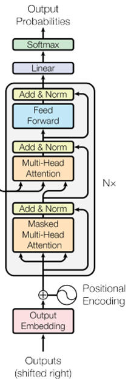

### 4.2 因果掩码

普通 Encoder self-attention 可以访问全部允许的输入位置；自回归 Decoder 只能使用当前输入位置及其之前的 token。因为目标已经右移，当前输入位置是预测目标的前一个 token，允许看“自己”不会泄露目标。

$$
M_{i,j}=\begin{cases}0&j\le i\\-\infty&j>i,\end{cases}
$$

$$
A=\mathrm{softmax}\left(\frac{QK^\top}{\sqrt{d_k}}+M\right).
$$

四个位置的掩码为：

$$
M=\begin{bmatrix}
0&-\infty&-\infty&-\infty\\
0&0&-\infty&-\infty\\
0&0&0&-\infty\\
0&0&0&0
\end{bmatrix}.
$$

第 22 页故事接龙例子“捡到本子→寻找主人→封皮变白→抢走本子”说明：当前这一棒只能看到已有前文，后面的故事还没有发生。训练时即使整句目标已知，也必须用因果掩码阻止模型提前看到未来答案。

### 4.3 错误累积与 EOS

课件第 23 页把“器”误生成为“气”，之后 Decoder 使用自己的错误输出，后续预测可能偏离正确句子。第 24 页继续生成“习惯……”说明模型不知道真实输出长度。

加入 END / EOS 后，目标序列应包含停止标记；模型生成 EOS 时结束。课件第 26 页完整路径为 `BOS → 机 → 器 → 学 → 习 → EOS`。实际生成还应设最大长度以处理一直不产生 EOS 的情况；课件提到训练或蒸馏问题可能造成不停输出，不能仅据这一现象判定具体原因。

<a id="nat" name="nat"></a>
## 5. 非自回归 Decoder

**对应课件第 27–28 页。** 非自回归（Non-autoregressive，NAT）减少或取消逐 token 对先前生成 token 的依赖，允许并行产生多个位置。课件用多个 START / 占位输入同时生成 $w_1,w_2,w_3,w_4$ 作简化图示。

确定输出长度的两种课件方案：独立预测长度，再按该长度解码；或输出一个足够长的序列，遇到 END 后忽略其余位置。位置编码等机制仍需让各输出槽位彼此区分。

| 特性 | AT | NAT |
|---|---|---|
| token 间依赖 | 按生成历史逐步建模 | 典型版本弱化直接逐步依赖 |
| 推理并行 | 不同生成时间步顺序进行 | 多位置可以并行 |
| 长度 | EOS 决定停止 | 需长度预测或停止处理等方案 |
| 优点 | 顺序一致性与条件建模 | 更低时延；课件指出某些 TTS 情境更稳定 |
| 难点 | 生成时延、错误累积 | 典型模型质量可能较低，多个合理输出的协调更难 |

课件所说的 **multi-modality** 在这里指**同一输入存在多个合理目标序列**，并非“图像、文字、语音”的模态类别。若各位置独立选择不同目标模式，可能生成相互不协调的词序列。NAT 的实际性能取决于依赖设计、蒸馏、迭代修正等方法，不是所有 NAT 都必然劣于 AT。

<a id="cross-attention" name="cross-attention"></a>
## 6. Cross-attention 与 T5

**对应课件第 30–32 页。** 在 self-attention 中，QKV 来自同一表示序列；在 cross-attention 中，**Q 来自 Decoder 当前层表示，K 与 V 来自 Encoder 输出**。它让目标生成位置选择源序列里相关的信息。

设 $H_e\in\mathbb R^{N\times d}$ 为源表示， $H_d\in\mathbb R^{T\times d}$ 为经过 masked self-attention 的目标表示：

$$
Q=H_dW_Q,\qquad K=H_eW_K,\qquad V=H_eW_V,
$$

$$
O=\mathrm{softmax}\left(\frac{QK^\top}{\sqrt{d_k}}+M_{\text{source-padding}}\right)V.
$$

分数矩阵形状为 $T\times N$ ，源长度与目标长度不必相同。Decoder 目标序列需要因果限制，Encoder 源序列通常已全部可见，因此 cross-attention 不使用目标的下三角掩码，但应屏蔽源序列 padding。

课件三源向量示例为 $a^1,a^2,a^3$ ：Decoder 从 START 得到 $q$ ，分别计算与 $k^1,k^2,k^3$ 的分数，归一化后汇聚：

$$
v_{\text{context}}=\alpha_1'v^1+\alpha_2'v^2+\alpha_3'v^3.
$$

下一步加入已生成的“机”，Decoder 查询变为 $q'$ ，权重重新计算，得到 $v'_{\text{context}}$ 。Encoder 输出可在这次生成中复用，但每个 Decoder 层拥有自己的投影参数。

课件提到 Google 的 T5：Text-to-Text Transfer Transformer，使用 Encoder–Decoder 结构，将任务统一组织成文本到文本形式。

<a id="teacher-forcing" name="teacher-forcing"></a>
## 7. Teacher forcing 与下一 token 训练

**对应课件第 33–36 页。** 每个位置的模型分布与真实标签比较，最小化交叉熵。第 34 页例子中，正确标签“机”的 one-hot 概率为 1，模型给“机”0.7，其他“学、器、鬼”各为 0.1，因此这一步损失为：

$$
\ell=-\log0.7\approx0.356675.
$$

### 7.1 Teacher forcing

训练 Decoder 时，把**真实的前一个目标 token**当输入，而不是先生成 token 再反馈：

| 位置 | 0 | 1 | 2 | 3 | 4 |
|---|---|---|---|---|---|
| Decoder 输入 | BOS | 机 | 器 | 学 | 习 |
| 监督目标 | 机 | 器 | 学 | 习 | EOS |

优势：每一步与 ground truth 对齐，训练信号稳定，更易学到正确依赖并较快收敛。结合因果掩码，Transformer 可同时计算这些位置的预测。

限制：训练时看到正确历史，推理时看到自己的预测，存在 exposure bias（暴露偏差）和 inference mismatch（训练推理不一致）；一旦误生成，错误可能累积。

### 7.2 自回归语言模型的移位对齐

第 36 页文本为 `I love dogs not cats`。实现可以从同一 token 序列构造输入与标签：

```text
原始 token 序列： [BOS, I, love, dogs, not, cats, EOS]
输入 input_ids：  [BOS, I, love, dogs, not, cats]
标签 labels：     [I, love, dogs, not, cats, EOS]
```

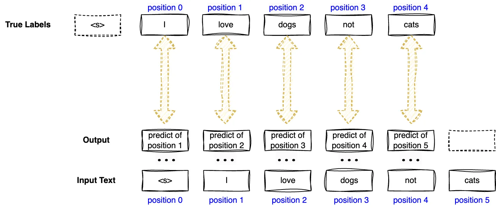

课件文字“标签右移一位”容易与数组索引方向混淆。准确关系是：**第 $i$ 个输出预测原始序列第 $i+1$ 个 token**；相对未移位的完整序列，作为 Decoder 输入的前缀向右增加了 BOS，而监督标签取后缀。不同接口可能内部自动 shift，必须核实并只移位一次。

<a id="loss" name="loss"></a>
## 8. 交叉熵完整数值例题

**对应课件第 37–40 页及图片。** 用 $S$ 表示参与损失的有效 token 数， $t_i$ 表示第 $i$ 个真实 token 的词表索引， $p_{i,t_i}$ 表示该位置对正确 token 的预测概率：

$$
L=-\frac1S\sum_{i=1}^{S}\log p_{i,t_i}.
$$

正确 token 的概率越接近 1，损失越小；越接近 0，损失越大。计算损失用真实标签所在的概率，不是模型 argmax 所在的概率。

### 8.1 第一步：把真实 token 转为词表索引

课件原图的完整小词表：

| 索引 | token |
|---:|---|
| 0 | `<s>` |
| 1 | I |
| 2 | am |
| 3 | not |
| 4 | love |
| 5 | hate |
| 6 | dogs |
| 7 | cats |
| 8 | fish |
| 9 | rabbit |

标签 `I love dogs not cats` 对应索引 `[1,4,6,3,7]`。

### 8.2 第二步：取出正确标签的概率

第 39–40 页原图完整显示前三个位置的概率：

| 索引 | token | 位置0，目标 I | 位置1，目标 love | 位置2，目标 dogs |
|---:|---|---:|---:|---:|
| 0 | `<s>` | 0.02 | 0.02 | 0.02 |
| 1 | I | **0.50** | 0.06 | 0.03 |
| 2 | am | 0.08 | 0.35 | 0.03 |
| 3 | not | 0.08 | 0.08 | 0.03 |
| 4 | love | 0.12 | **0.30** | 0.05 |
| 5 | hate | 0.04 | 0.04 | 0.04 |
| 6 | dogs | 0.05 | 0.05 | **0.33** |
| 7 | cats | 0.05 | 0.05 | 0.05 |
| 8 | fish | 0.03 | 0.03 | 0.40 |
| 9 | rabbit | 0.03 | 0.02 | 0.02 |

每个位置列的概率和均为 1。第二个位置最高概率词是 am，第三个位置最高概率词是 fish，但标签仍分别是 love、dogs，故损失取 0.30、0.33。原图另给出最后两目标 not、cats 的概率 0.45、0.60，未给全这两个位置的完整分布，不自行补造。

### 8.3 第三步：负对数并求均值

$$
L=-\frac15\left(\log0.50+\log0.30+\log0.33+\log0.45+\log0.60\right)
\approx0.863023.
$$

| 目标 | 正确概率 | $-\log p$ |
|---|---:|---:|
| I | 0.50 | 0.693147 |
| love | 0.30 | 1.203973 |
| dogs | 0.33 | 1.108663 |
| not | 0.45 | 0.798508 |
| cats | 0.60 | 0.510826 |

结果与原图的 **0.86302** 一致，使用自然对数。把概率先平均再取负对数，会得到另一个量，不能替换这里的“负对数的平均”。

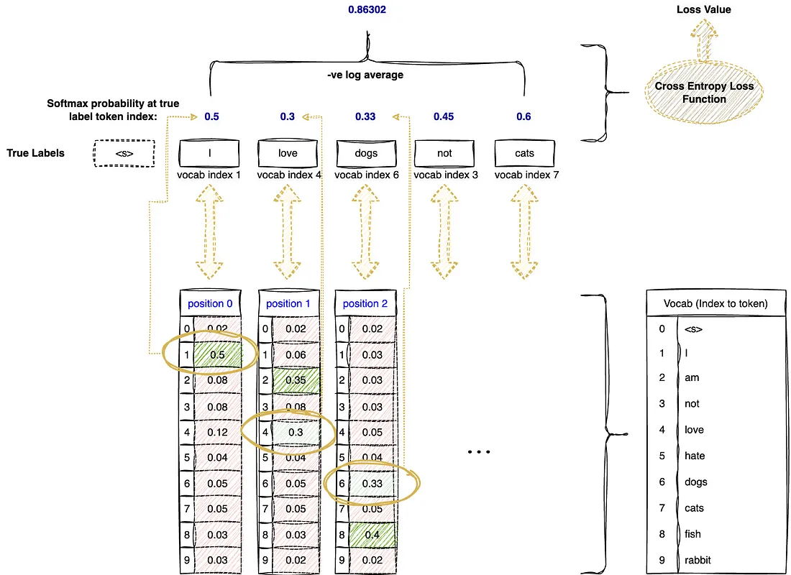

第 40 页标题括号中有“BLEU”，但本页计算的是交叉熵。BLEU 是基于生成文本与参考文本 n-gram 重合等因素的评价指标，不能与 token 交叉熵混为一谈。

实际实现可直接把 logits 交给支持 log-softmax 的交叉熵函数以提高数值稳定性。padding 对应标签要忽略；分母为有效监督 token 数。是否纳入 EOS、只监督回答部分还是全文，需要与训练目标一致。

<a id="optimization" name="optimization"></a>
## 9. 优化器与学习率调度

**对应课件第 41–43 页；合并第 2 份课件第 59–60 页及两章备注。** 优化器决定如何根据梯度更新参数，学习率调度决定总体步长如何随训练进程变化。

### 9.1 优化器比较

| 方法 | 课件与原图涉及的作用 |
|---|---|
| SGD | 按当前梯度下降，复杂损失面上可能震荡 |
| Momentum | 累积历史更新方向，引入惯性使路径更平滑 |
| NAG | 在前瞻位置考虑梯度的动量变体 |
| AdaGrad | 累积平方梯度，为不同参数设置不同更新尺度 |
| AdaDelta | 使用滑动统计调整更新尺度，缓解累计量持续增大的问题 |
| RMSprop | 平方梯度的指数滑动平均，逐参数调整尺度 |
| Adam | 结合梯度一阶与二阶矩估计及偏差修正 |

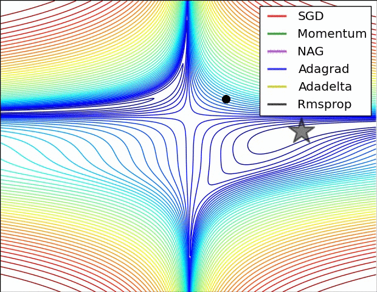

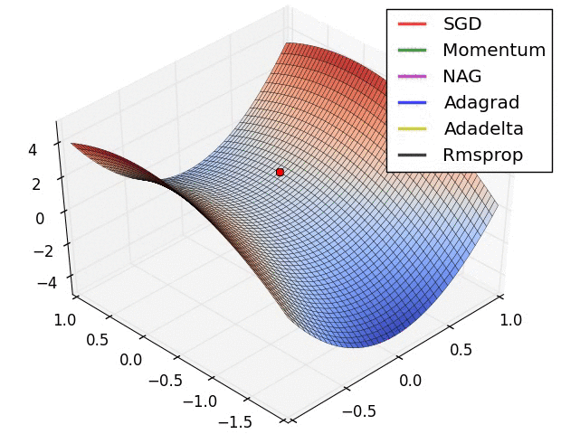

课件正文强调 RMSprop、Adam，原动画图例还包括 SGD、Momentum、NAG、AdaGrad、AdaDelta。动画展示特定合成损失面的路径，不能直接当作真实任务的优化器排名。

补充 Adam 的核心公式，记当前梯度 $g_t$ ：

$$
m_t=\beta_1m_{t-1}+(1-\beta_1)g_t,\qquad
v_t=\beta_2v_{t-1}+(1-\beta_2)g_t^2,
$$

$$
\hat m_t=\frac{m_t}{1-\beta_1^t},\quad
\hat v_t=\frac{v_t}{1-\beta_2^t},\quad
\theta_t=\theta_{t-1}-\eta_t\frac{\hat m_t}{\sqrt{\hat v_t}+\epsilon}.
$$

平方、开方和除法逐元素进行。自适应优化器调整更新尺度，不保证反向传播的原始梯度不会消失或爆炸；必要时还应处理初始化、残差、归一化、数值精度与梯度裁剪等因素。

### 9.2 Warm-up、稳定阶段、Decay

课件图的横轴为 iteration / epoch，纵轴为学习率；分为预热、较高学习率的稳定阶段、逐渐衰减三个阶段。初期从较小学习率上升，避免不稳定的大幅参数更新；中期保持较高步长加速学习；后期下降以更细致地优化。

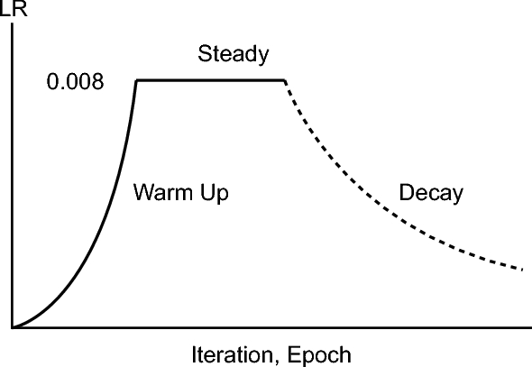

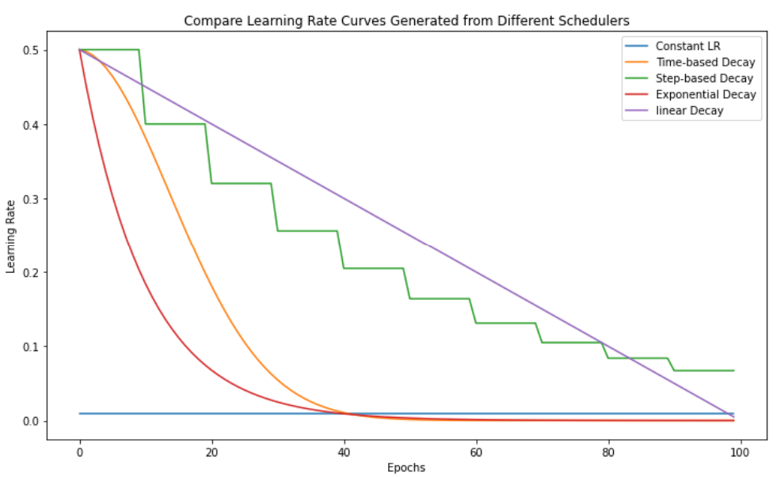

图例保留 Constant、Time-based、Step-based、Exponential、Linear。不同策略的标准形式可写为：

| 调度 | 辅助公式 | 特点 |
|---|---|---|
| Constant | $\eta_t=\eta_0$ | 不随步数变化 |
| Time-based | $\eta_t=\eta_0/(1+kt)$ | 按时间降低；不是统一意义上的线性衰减 |
| Step-based | $\eta_t=\eta_0\rho^{\lfloor t/K\rfloor}$ | 每隔 $K$ 步降低一次 |
| Exponential | $\eta_t=\eta_0e^{-kt}$ | 指数下降 |
| Linear | $\eta_t=\eta_{\min}+(\eta_{\max}-\eta_{\min})(1-u)$ | 随进度 $u$ 线性下降 |
| Cosine | 见下式 | 按余弦形状平滑下降 |

课件备注称 Time-based 为“线性下降”，这里区分名字与具体公式；原图曲线仍保留。调度降低的是更新步长，不直接改变已经计算出的梯度，过小学习率导致更新很慢，不等同于“梯度消失”。

### 9.3 余弦学习率例题参数

第 43 页图片给出以下全部配置：

```text
num_warmup_steps = 10
num_training_steps = 2000
grad_accumulation_steps = 1
min_lr = 1e-4
max_lr = 5e-4
```

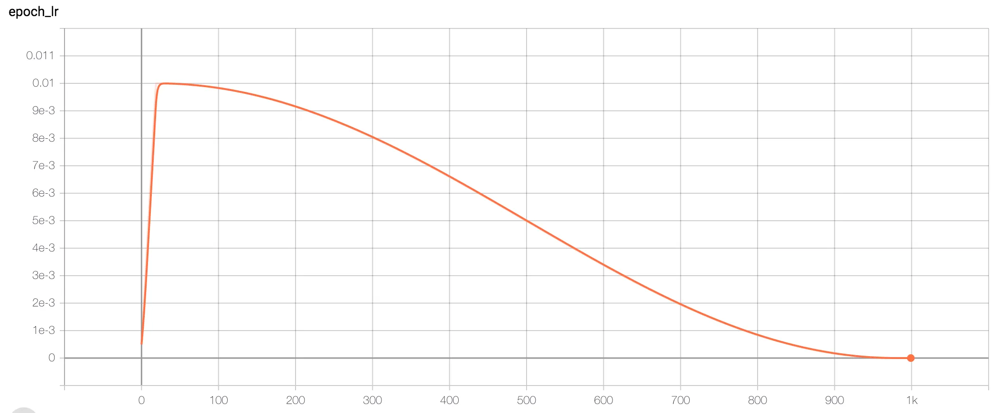

设预热步数 $T_w=10$ ，总优化更新数 $T=2000$ 。以下是与这些参数相容的一种明确实现，不宣称课件提供了完整调度代码：

$$
\eta_t=\eta_{\max}\frac{t}{T_w},\quad 0\le t\le T_w,
$$

$$
\eta_t=\eta_{\min}+\frac12(\eta_{\max}-\eta_{\min})
\left[1+\cos\left(\pi\frac{t-T_w}{T-T_w}\right)\right],\quad T_w<t\le T.
$$

在这个约定下 $\eta_0=0$ 、 $\eta_{10}=5\times10^{-4}$ 、 $\eta_{1005}=3\times10^{-4}$ 、 $\eta_{2000}=10^{-4}$ 。步数是 optimizer update 的计数；若增加梯度累积，一个更新可能对应多个 micro-batch，调度器计数需一致。

余弦衰减是平滑 annealing，不能等同于分段常数的 step decay；也不保证避开局部最优。原课件把二者混写，这里保留方法并修正分类。

<a id="padding" name="padding"></a>
## 10. Padding 与掩码

**对应课件第 44–45 页及第 51 页 Left Padding 提示。** 普通 batch 需要可堆叠的张量，不同长度的输入通过补齐形成统一长度：

```text
原序列：       A1 A2 A3       B1 B2       C1
右侧 padding： A1 A2 A3       B1 B2 PAD   C1 PAD PAD
左侧 padding： A1 A2 A3       PAD B1 B2   PAD PAD C1
```

课件使用数字 0 画 padding；实际实现应使用指定的 PAD token / padding value，不能假定编号 0 就一定是 PAD。

关键配套处理：

1. **注意力 padding mask：** 真实 token 可用，padding 的 Key 位置不可用，避免把填充当内容。
2. **损失 mask：** padding 标签不参与 token 平均交叉熵。
3. **因果 mask：** Decoder 仍需禁止未来信息，两种 mask 结合使用。
4. **位置编号：** 左填充时，为真实 token 构造与有效序列一致的位置，padding 位置编号按实现处理。

Decoder-only 批量生成时，若代码直接取 `logits[:, -1, :]`，左填充能让每个样本的最后位置都是有效 prompt 的末尾；右填充则需要另行定位有效末位。不能把“必须左填充”推广到所有训练接口，正确选择取决于读 logits、位置编码与 mask 的具体实现。

若某个 Query 的所有 Key 都被屏蔽，直接 softmax 全为 $-\infty$ 的分数可能出现 NaN；实现需对 padding query 与掩码组合做一致处理。补齐的位置可以有内部表示，但不应作为有效预测参与损失或生成。

<a id="beam" name="beam"></a>
## 11. Greedy 与 Beam Search

**对应课件第 46–47 页。** Greedy decoding 每步选择当前最高概率 token：

$$
y_t=\arg\max_v p(v\mid y_{<t},x).
$$

局部最优不保证整条路径最大。课件仅有 A、B 两个 token 的三步树给出：

| 选择 | 条件概率 |
|---|---:|
| 第一步 A | 0.6 |
| 第一步 B | 0.4 |
| A 后再 A / B | 0.4 / 0.6 |
| B 后选择 B | 0.9 |
| AB 后选择 B | 0.6 |
| BB 后选择 B | 0.9 |

贪心路径是 A→B→B（红色），概率为 $0.6\times0.6\times0.6=0.216$ ；图中更优路径是 B→B→B（绿色），概率为 $0.4\times0.9\times0.9=0.324$ 。

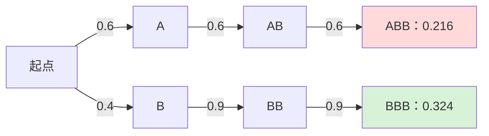

这个图重画的是原课件用于比较的两条路径；未显示的其他分支不影响比较，不能把原图没标注的概率补成测得数据。

完整枚举长度 $L$ 的候选大约有 $V^L$ 条，通常不可行。Beam Search 每步保存 $k$ 条评分最高的前缀；扩展这些前缀后，再从候选中选前 $k$ 条。常用评分是：

$$
\log p(y\mid x)=\sum_t\log p(y_t\mid y_{<t},x),
$$

可以按任务加入长度归一化或惩罚。 $k=1$ 退化为 greedy；有限 beam 会剪枝，仍不保证全局最优。

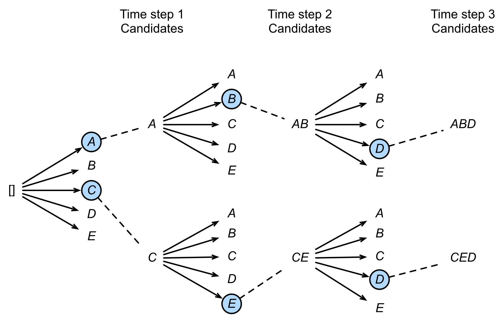

该图 beam width 为 2：首先保留 A、C，再保留 AB、CE，下一步得到 ABD、CED。它说明保存多个候选的过程，不是上一张两 token 树的同一数值例题。

课件第 46 页标题提到 GPT，这并不表示所有 GPT 类生成都默认使用 beam search；解码策略是独立配置。

<a id="temperature" name="temperature"></a>
## 12. 温度采样

**对应课件第 48 页，包括图片中的公式与说明。** 给定第 $i$ 个 token 的 logit $z_i$ ，温度 $\tau>0$ 的分布为：

$$
p_i(\tau)=\frac{\exp(z_i/\tau)}{\sum_{j=1}^V\exp(z_j/\tau)}.
$$

课件用 $T$ 表示温度；这里用 $\tau$ 避免与训练总步数混淆。 $\tau=1$ 是普通 softmax；小于 1 使分布更尖锐，大于 1 使分布更平缓。固定 logits 时，增大正温度一般提高分布熵，使低分 token 更可能被抽到。

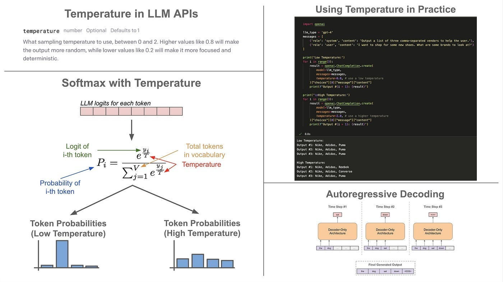

| 课件给出的经验范围 | 趋势 | 课件示例场景 |
|---|---|---|
| 0.1–0.3 | 较集中、较可预测 | 翻译、代码、事实问答 |
| 0.7–1.0 | 多样性与集中程度的折中 | 聊天、教学解释 |
| 1.0–1.5 及以上 | 更随机、多样 | 创意写作、诗歌、广告语 |

这些范围是教学经验示例，不是跨模型通用最优参数；低温不保证事实准确，高温也不保证创造质量。随机抽样仍需考虑种子和其他采样参数，低温也不自动保证完全可重复。

数学极限 $\tau\to0^+$ 在唯一最大 logit 情况下集中到该 token；实际代码不能简单除以零，可单独走 greedy 分支。若只做 argmax，正温度缩放不改变 logit 排序；温度主要影响**抽样**的分布。

课件提出“上下文重复怎么处理”，没有给出完整答案。补充可操作方向：检查训练样本与停止条件，设置适当的生成长度，可结合 top-k / top-p、重复惩罚或重复 n-gram 限制；这些属于生成策略补充，不把温度本身当成解决重复的保证。

<a id="decoder-only" name="decoder-only"></a>
## 13. Decoder-only 与实验实现清单

**对应课件第 49、51 页；合并第 2 份课件第 58 页。** GPT、LLaMA、Falcon、Mistral 等课件列举的模型使用 decoder-only 类型的自回归主干。它堆叠 causal self-attention 与 FFN，配残差、归一化和位置机制，没有经典 Encoder–Decoder 的独立源 Encoder 与 cross-attention 子层。

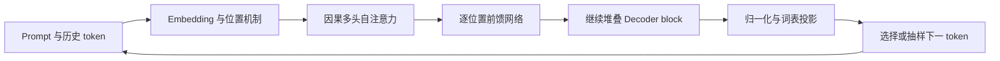

残差和归一化包围各子层，具体采用 Pre-LN / Post-LN、LayerNorm / 其他归一化取决于模型。因果掩码确保每个预测只依赖已给出的历史；它简化了条件生成主干，但不能单凭这种架构就保证梯度稳定。

### 13.1 Lab 1 的全部提示

课件没有附上 `model.py`、`generate.py` 或 `train.py` 源码，只列实现关注点；以下按职责整理，避免把提示误写成已有程序。

| 文件职责 | 课件列出的技术点 | 实现时要落实的关系 |
|---|---|---|
| `model.py` | Decoder-only architecture；Multi-Head Attention；Residual Connection；Positional Encoding；GELU Activation | QKV 与头维度匹配；因果 mask；残差尺寸匹配；位置编码与 padding 对齐；FFN 使用所选激活 |
| `generate.py` | Temperature；Left Padding | 从最后有效 token 取分布；正确处理 EOS；温度为零时单独处理；左填充需同时处理 mask 与 position ids |
| `train.py` | Cosine Learning Rate；Loss Function；Training Data | 输入与目标错开一个 token；屏蔽 padding 损失；优化更新步数与调度步数一致；数据分词与词表一致 |

### 13.2 GELU 的必要补充

课件只给出名称。为了能理解实验的激活选择，补充其定义与常用近似：

$$
\mathrm{GELU}(x)=x\Phi(x),
$$

$$
\mathrm{GELU}(x)\approx\frac x2\left[1+\tanh\left(\sqrt{\frac2\pi}(x+0.044715x^3)\right)\right].
$$

$\Phi$ 为标准正态分布的累积分布函数。它对输入做平滑的概率式门控，与 ReLU 的硬截断不同；精确版本和 tanh 近似版本应在实现中明确选择。[GELU 原论文](https://arxiv.org/abs/1606.08415)

### 13.3 一次完整的数据路径

```text
文本 → 分词与 token 编号 → 组成 batch 并 padding
     → 构造位置、padding mask、causal mask
     → Embedding → 多层 Decoder block → 词表 logits
训练：logits 与下一 token 标签对齐 → 有效 token 交叉熵 → 梯度与优化更新
推理：最后有效位置的 logits → 温度与选择策略 → 新 token → 遇 EOS 停止
```

核对重点是 token 与标签是否错位、mask 是否阻止泄露、padding 是否被忽略、多头切分是否正确，以及调度器是否以实际参数更新计步。课件所需技术在前文均给出公式、例题或具体条件。
